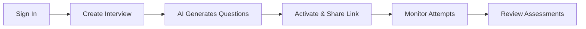
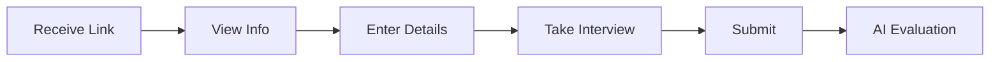

# TalentGeenie Platform 🚀

**AI-Powered Interview Management System**

> Create intelligent interviews, evaluate candidates automatically, and make better hiring decisions using AI.

---

## 🌟 Overview

TalentGeenie is a comprehensive platform that revolutionizes the technical interview process by leveraging artificial intelligence. Generate tailored interview questions from job descriptions and receive instant, detailed candidate assessments.

**Live Project**: https://lovable.dev/projects/5d0a16bd-a9fe-48d8-a184-f1322a8407f0

---

## ✨ Key Features

### 🤖 AI-Powered
- **Smart Question Generation**: Auto-generate 5-100 questions from job descriptions
- **Intelligent Skill Extraction**: AI automatically suggests 10-15 relevant skills from your job title and description
- **Flexible Question Types**: Control MCQ vs descriptive distribution (0-100%)
- **Instant Assessments**: AI evaluates candidates with strict scoring rules
- **Hiring Recommendations**: Get clear recommendations (Strong Hire, Hire, Consider, Reject)
- **Accurate Evaluation**: MCQs scored as exact match (100% or 0%), descriptive questions evaluated holistically

### 🎯 Customizable
- **AI-Powered Key Skills**: One-click addition of AI-suggested skills including technical, soft, tools, and methodologies
- **Difficulty Control**: Set easy/medium/hard distribution (must total 100%)
- **Question Type Control**: Set MCQ percentage (0-100%), remaining are descriptive
- **Skill Focus**: Weight questions toward critical skills with percentage sliders
- **Time Limits**: Optional time constraints with auto-submit

### 🔐 Secure
- **Row-Level Security**: All database tables protected with enhanced RLS policies
- **PII Protection**: Candidate contact information immutable after submission
- **Input Validation**: Zod schemas validate all user inputs
- **Session Tokens**: Secure candidate authentication with cryptographic tokens
- **Role-Based Access**: 6 distinct roles (Admin, HR, Interviewer, Contributor, Candidate, Guest)
- **Secure Functions**: SECURITY DEFINER functions prevent data exposure
- **Application-Level Security**: Role assignment handled in app code, not database triggers

### 👥 User-Friendly
- **Simple Candidate Access**: Take interviews via secure share links (name + email only)
- **Real-time Progress**: Track candidates as they complete interviews
- **Detailed Reports**: Comprehensive assessment reports with topic-wise breakdown
- **One Attempt Per Email**: Prevents duplicate submissions

---

## 🏗️ Tech Stack

| Layer | Technology |
|-------|-----------|
| **Frontend** | React 18, TypeScript, Vite |
| **UI** | Tailwind CSS, shadcn/ui |
| **Backend** | Supabase (Lovable Cloud) |
| **Database** | PostgreSQL with RLS |
| **AI** | Lovable AI (Gemini 2.5 Flash) |
| **Auth** | Supabase Auth (Email + Anonymous) |

---

## 🚀 Quick Start

### Using Lovable (Recommended)

1. Visit: https://lovable.dev/projects/5d0a16bd-a9fe-48d8-a184-f1322a8407f0
2. Start prompting to make changes
3. Changes are auto-committed to this repo

### Local Development

**Prerequisites**: Node.js & npm ([install with nvm](https://github.com/nvm-sh/nvm#installing-and-updating))

```bash
# Clone the repository
git clone <YOUR_GIT_URL>

# Navigate to project
cd talentgeenie

# Install dependencies
npm install

# Start development server
npm run dev
```

### Deploy Anywhere

This app can be deployed to **any platform**:

✅ **Personal Laptop** - Run locally for development or production  
✅ **AWS** - Amplify, S3+CloudFront, EC2, Elastic Beanstalk  
✅ **Azure** - Static Web Apps, App Service  
✅ **GCP** - Firebase Hosting, Cloud Run, App Engine  
✅ **Serverless** - Vercel, Netlify (one-click deploy)  
✅ **Docker** - Container-based deployment anywhere  

**See the complete [Deployment Guide](/docs) in the documentation section.**

Key points:
- Frontend is a standard React/Vite app - deploy anywhere
- Backend uses Lovable Cloud (Supabase) - no separate backend deployment needed
- Just set environment variables and you're ready to go!

---

## 📖 User Flows

### For HR/Interviewers



### For Candidates



---

## 📁 Project Structure

```
src/
├── components/
│   ├── ui/              # shadcn/ui components
│   └── AppNavigation.tsx # Main nav bar
├── pages/
│   ├── Landing.tsx      # Home page
│   ├── Auth.tsx         # Sign in/up
│   ├── Dashboard.tsx    # Interview Management page
│   ├── CreateInterview.tsx # Interview creator
│   ├── InterviewDetail.tsx # Management
│   ├── TakeInterview.tsx   # Candidate interface
│   └── AssessmentReport.tsx # AI evaluation
├── lib/
│   ├── validations.ts   # Zod schemas
│   └── utils.ts         # Utilities
└── integrations/
    └── supabase/        # DB client & types

supabase/
├── functions/
│   ├── generate-questions/  # AI question gen
│   └── evaluate-interview/  # AI assessment
└── migrations/          # Database migrations
```

---

## 🔐 Security Architecture

### Multi-Layer Defense

```
┌─────────────────────────────────────┐
│   APPLICATION LAYER                 │
│   • Input Validation (Zod)         │
│   • Client-side Security            │
└──────────┬──────────────────────────┘
           │
┌──────────▼──────────────────────────┐
│   DATABASE LAYER                    │
│   • Row-Level Security (RLS)       │
│   • Secure Functions                │
└──────────┬──────────────────────────┘
           │
┌──────────▼──────────────────────────┐
│   AUTHENTICATION LAYER              │
│   • Email/Password (Staff)          │
│   • Anonymous (Candidates)          │
│   • Session Tokens                  │
└─────────────────────────────────────┘
```

### Input Validation Rules

| Field | Rules |
|-------|-------|
| Email | Valid format, max 255 chars |
| Password | 8+ chars, uppercase, lowercase, number |
| Name | 2-100 chars, letters/spaces/hyphens only |
| Job Description | 50-10,000 chars |
| Answers | 1-5,000 chars |

### Database Security

- ✅ **All tables have RLS enabled**
- ✅ **Anonymous users blocked from direct table access**
- ✅ **Secure functions for controlled data access**
- ✅ **Session tokens for candidate authentication**
- ✅ **Role-based access control (Admin/HR/Interviewer/Contributor/Candidate/Guest)**

---

## 🎨 Design System

### Color Palette

| Color | HSL | Usage |
|-------|-----|-------|
| Primary | `243 75% 59%` | Buttons, links, highlights |
| Accent | `262 83% 58%` | Secondary actions |
| Success | `142 76% 36%` | Positive states |
| Warning | `38 92% 50%` | Warnings, cautions |
| Destructive | `0 84% 60%` | Errors, deletions |

### Gradients

```css
--gradient-primary: linear-gradient(135deg, hsl(243 75% 59%), hsl(262 83% 58%));
--gradient-hero: linear-gradient(135deg, hsl(243 75% 59%) 0%, hsl(262 83% 58%) 50%, hsl(280 80% 55%) 100%);
```

---

## 🧪 Testing Checklist

- [x] Authentication (Sign up/in/out)
- [x] Interview creation with AI
- [x] Share link generation
- [x] Candidate interview flow
- [x] AI evaluation
- [x] Assessment viewing
- [x] Role management
- [x] RLS policy enforcement
- [x] Input validation

---

## 📚 Documentation

- **Security**: See `SECURITY.md` and `SECURITY_FIXES.md`
- **Implementation**: See `SECURITY_IMPLEMENTATION.md`
- **In-App Docs**: Available at `/docs` route

---

## 🛠️ Edge Functions

### generate-questions
Generates interview questions using AI based on job description and requirements.

**Input**: Job description, question count, difficulty/topic distribution  
**Output**: Array of generated questions with topics and difficulties

### evaluate-interview
Evaluates candidate responses using AI.

**Input**: Attempt ID  
**Output**: Overall score, topic scores, strengths, weaknesses, hiring decision

---

## 🔧 Environment

All environment variables are auto-configured by Lovable Cloud:

```env
VITE_SUPABASE_URL=<auto-configured>
VITE_SUPABASE_PUBLISHABLE_KEY=<auto-configured>
VITE_SUPABASE_PROJECT_ID=<auto-configured>
```

**No manual setup required!** ✨

---

## 📈 Roadmap

### Phase 1 (Current)
- [x] AI question generation
- [x] Candidate interview flow
- [x] AI assessment
- [x] Role management
- [x] Comprehensive security

### Phase 2 (Planned)
- [ ] Interview templates
- [ ] PDF export
- [ ] Email notifications
- [ ] Real-time updates

### Phase 3 (Future)
- [ ] Advanced analytics
- [ ] Calendar integration
- [ ] Video interviews
- [ ] Multi-language support

---

## 🤝 Contributing

This is a Lovable Cloud project. Make changes through:

1. **Lovable Editor** (Primary): https://lovable.dev/projects/5d0a16bd-a9fe-48d8-a184-f1322a8407f0
2. **Local Development**: Clone, edit, push (changes sync to Lovable)
3. **GitHub**: Direct file edits
4. **Codespaces**: Full cloud IDE

---

## 🔗 Custom Domain

Want a custom domain like `interviews.yourcompany.com`?

1. Navigate to **Project > Settings > Domains**
2. Click **Connect Domain**
3. Follow the setup wizard

[Learn more about custom domains](https://docs.lovable.dev/features/custom-domain)

---

## 📄 License

Proprietary - All rights reserved

---

## 📞 Support

- **Security Issues**: See `SECURITY.md`
- **Technical Support**: Contact system administrator
- **Documentation**: Available at `/docs` in the app

---

## 🎯 Key Stats

| Metric | Value |
|--------|-------|
| Database Tables | 13 |
| Edge Functions | 5 |
| User Roles | 6 |
| UI Components | 40+ |
| Pages/Routes | 13 |
| Security Policies | 30+ |
| Input Validations | 8 schemas |

---

**Built with ❤️ using Lovable Cloud**

*Empowering better hiring decisions through AI*
