# TalentGeenie — High-Level Design (HLD)

**Document Version:** 2.0  
**Date:** March 5, 2026  
**Product:** TalentGeenie — AI-Powered Interview & Learning Platform  
**Classification:** Internal / Confidential  

---

## Table of Contents

1. [Introduction](#1-introduction)
2. [System Architecture Overview](#2-system-architecture-overview)
3. [Technology Stack](#3-technology-stack)
4. [System Context Diagram](#4-system-context-diagram)
5. [Component Architecture](#5-component-architecture)
6. [Data Architecture](#6-data-architecture)
7. [Authentication & Authorization Architecture](#7-authentication--authorization-architecture)
8. [AI Architecture](#8-ai-architecture)
9. [Infrastructure & Deployment Architecture](#9-infrastructure--deployment-architecture)
10. [Integration Architecture](#10-integration-architecture)
11. [Key Design Decisions](#11-key-design-decisions)
12. [Scalability Strategy](#12-scalability-strategy)
13. [Security Architecture](#13-security-architecture)

---

## 1. Introduction

### 1.1 Purpose

This document presents the High-Level Design (HLD) for the TalentGeenie platform. It describes the system architecture, major components, their interactions, and the key design decisions that shape the platform.

### 1.2 Scope

TalentGeenie is a multi-tenant SaaS platform comprising:
- **Frontend**: React SPA with hybrid mobile app support (Capacitor)
- **Backend**: Self-hosted Supabase (10 Docker services)
- **AI Engine**: Google Gemini integration for question generation and evaluation
- **Proctoring Engine**: Browser-based video/audio monitoring with AI analysis

### 1.3 References

| Document | Location |
|----------|----------|
| Requirements (SRS) | `docs/REQUIREMENTS_DOCUMENT.md` |
| Low-Level Design (LLD) | `docs/LOW_LEVEL_DESIGN.md` |
| Security Audit | `SECURITY_AUDIT_COMPLETE.md` |

---

## 2. System Architecture Overview

### 2.1 Architecture Style

TalentGeenie follows a **modular monolith frontend + serverless backend** architecture:

- **Frontend**: Single React SPA handling all UI concerns
- **Backend**: Supabase platform providing authentication, database, storage, and edge functions
- **API Gateway**: Kong proxies all API requests
- **Database**: PostgreSQL with RLS for multi-tenant data isolation

### 2.2 High-Level Architecture Diagram

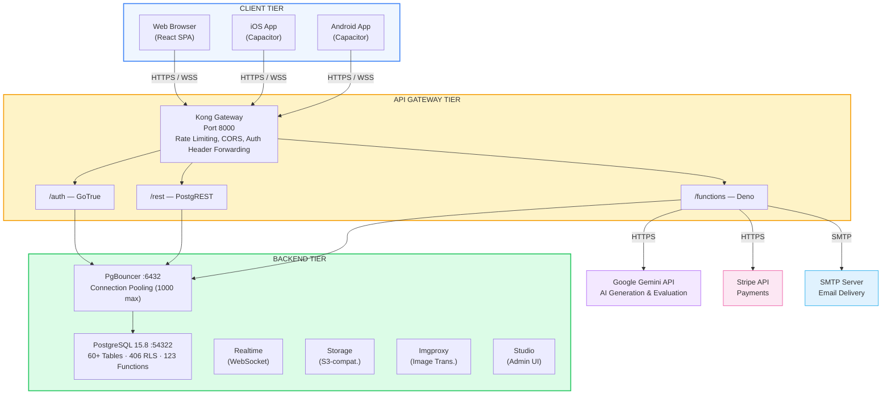

---

## 3. Technology Stack

### 3.1 Frontend Stack

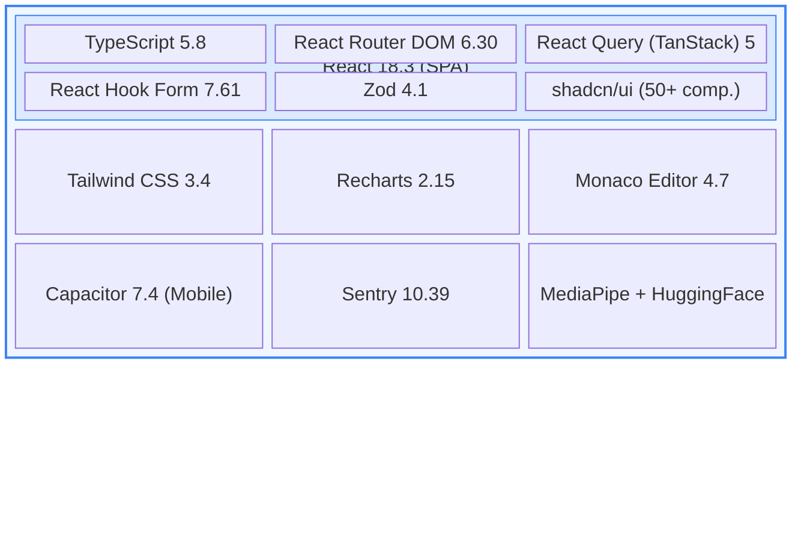

**Build:** Vite 5.4 + SWC

### 3.2 Backend Stack

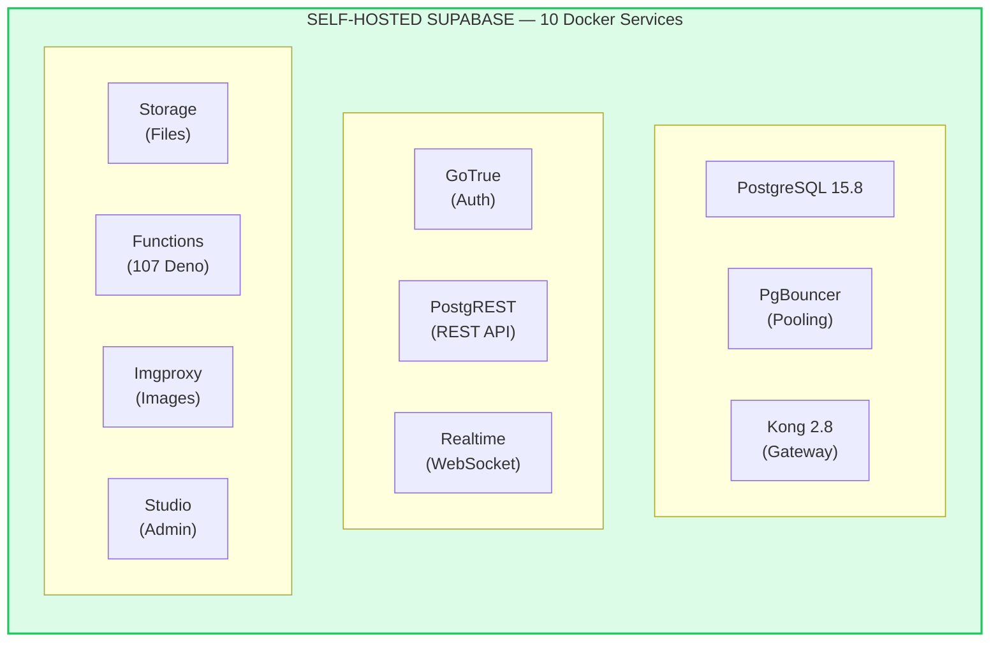

---

## 4. System Context Diagram

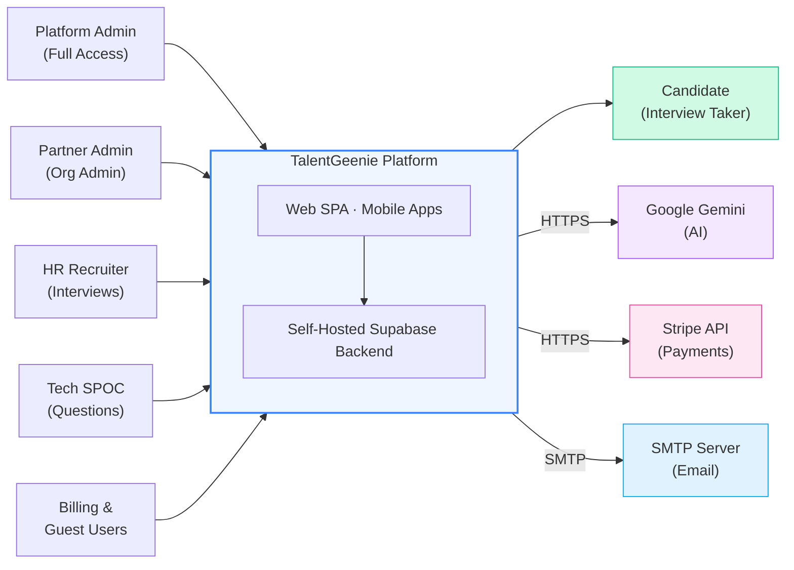

---

## 5. Component Architecture

### 5.1 Frontend Module Decomposition

```
┌─────────────────────────────────────────────────────────────────────┐
│                      REACT APPLICATION                              │
│                                                                     │
│  ┌──────────────────────────────────────────────────────────────┐  │
│  │                    APP SHELL                                  │  │
│  │  ┌─────────────┐ ┌─────────────┐ ┌────────────────────────┐ │  │
│  │  │  AuthContext │ │    Org      │ │   React Query          │ │  │
│  │  │  Provider   │ │  Context    │ │   Provider             │ │  │
│  │  └─────────────┘ └─────────────┘ └────────────────────────┘ │  │
│  │  ┌─────────────┐ ┌─────────────┐ ┌────────────────────────┐ │  │
│  │  │ErrorBoundary│ │  Sonner     │ │  React Router          │ │  │
│  │  │  (Sentry)   │ │  Toaster   │ │  BrowserRouter         │ │  │
│  │  └─────────────┘ └─────────────┘ └────────────────────────┘ │  │
│  └──────────────────────────────────────────────────────────────┘  │
│                                                                     │
│  ┌──────────────────────── LAYOUTS ─────────────────────────────┐  │
│  │                                                               │  │
│  │  ┌─────────────┐  ┌──────────────┐  ┌─────────────────────┐ │  │
│  │  │  AppLayout  │  │ AdminLayout  │  │  PartnerLayout      │ │  │
│  │  │  (Base)     │  │ (/admin/*)   │  │ (/partner/*)        │ │  │
│  │  └─────────────┘  └──────────────┘  └─────────────────────┘ │  │
│  │                                                               │  │
│  │  Shared: AppNavbar │ RoleBreadcrumbs │ ImpersonationBanner  │  │
│  └───────────────────────────────────────────────────────────────┘  │
│                                                                     │
│  ┌──────────────────── FEATURE MODULES ─────────────────────────┐  │
│  │                                                               │  │
│  │  ┌─────────────────┐  ┌──────────────────┐                  │  │
│  │  │   INTERVIEW      │  │   PROCTORING      │                  │  │
│  │  │   MODULE         │  │   MODULE           │                  │  │
│  │  │                  │  │                    │                  │  │
│  │  │ • CreateInterview│  │ • PreInterviewCheck│                  │  │
│  │  │ • InterviewDetail│  │ • ProctoringMonitor│                  │  │
│  │  │ • Dashboard      │  │ • ProctoringReport │                  │  │
│  │  │ • TakeInterview  │  │ • LiveStreamViewer │                  │  │
│  │  │ • QuickCreate    │  │ • VideoPlayer      │                  │  │
│  │  │ • JDBuilder      │  │ • Integrity Checks │                  │  │
│  │  │ • Templates      │  │ • 13 components    │                  │  │
│  │  │ • QuestionRepo   │  │                    │                  │  │
│  │  └─────────────────┘  └──────────────────┘                  │  │
│  │                                                               │  │
│  │  ┌─────────────────┐  ┌──────────────────┐                  │  │
│  │  │   LEARNING       │  │   ADMIN           │                  │  │
│  │  │   MODULE         │  │   MODULE           │                  │  │
│  │  │                  │  │                    │                  │  │
│  │  │ • LearningDash   │  │ • AdminHub         │                  │  │
│  │  │ • MyLearningPlan │  │ • UserManagement   │                  │  │
│  │  │ • Certifications │  │ • OrgManagement    │                  │  │
│  │  │ • TakeCert       │  │ • AIConfiguration  │                  │  │
│  │  │ • MyCertificates │  │ • BillingMgmt      │                  │  │
│  │  │ • LearningHistory│  │ • SystemMonitoring │                  │  │
│  │  │ • CertVerify     │  │ • 30+ pages        │                  │  │
│  │  └─────────────────┘  └──────────────────┘                  │  │
│  │                                                               │  │
│  │  ┌─────────────────┐  ┌──────────────────┐                  │  │
│  │  │   PARTNER        │  │   BILLING         │                  │  │
│  │  │   MODULE         │  │   MODULE           │                  │  │
│  │  │                  │  │                    │                  │  │
│  │  │ • PartnerPortal  │  │ • PartnerBilling   │                  │  │
│  │  │ • OrgSettings    │  │ • PlanManagement   │                  │  │
│  │  │ • OrgAnalytics   │  │ • PaymentGateway   │                  │  │
│  │  │ • UserManagement │  │ • Invoices         │                  │  │
│  │  │ • PartnerReports │  │ • Subscriptions    │                  │  │
│  │  └─────────────────┘  └──────────────────┘                  │  │
│  └───────────────────────────────────────────────────────────────┘  │
│                                                                     │
│  ┌──────────────── SHARED / CROSS-CUTTING ──────────────────────┐  │
│  │  ┌──────┐ ┌──────────┐ ┌──────────┐ ┌───────────┐          │  │
│  │  │50+ UI│ │  Hooks   │ │  Utils   │ │  Contexts │          │  │
│  │  │Comps │ │ (25+)    │ │  (30+)   │ │   (3)     │          │  │
│  │  └──────┘ └──────────┘ └──────────┘ └───────────┘          │  │
│  └───────────────────────────────────────────────────────────────┘  │
└─────────────────────────────────────────────────────────────────────┘
```

### 5.2 Backend Service Architecture

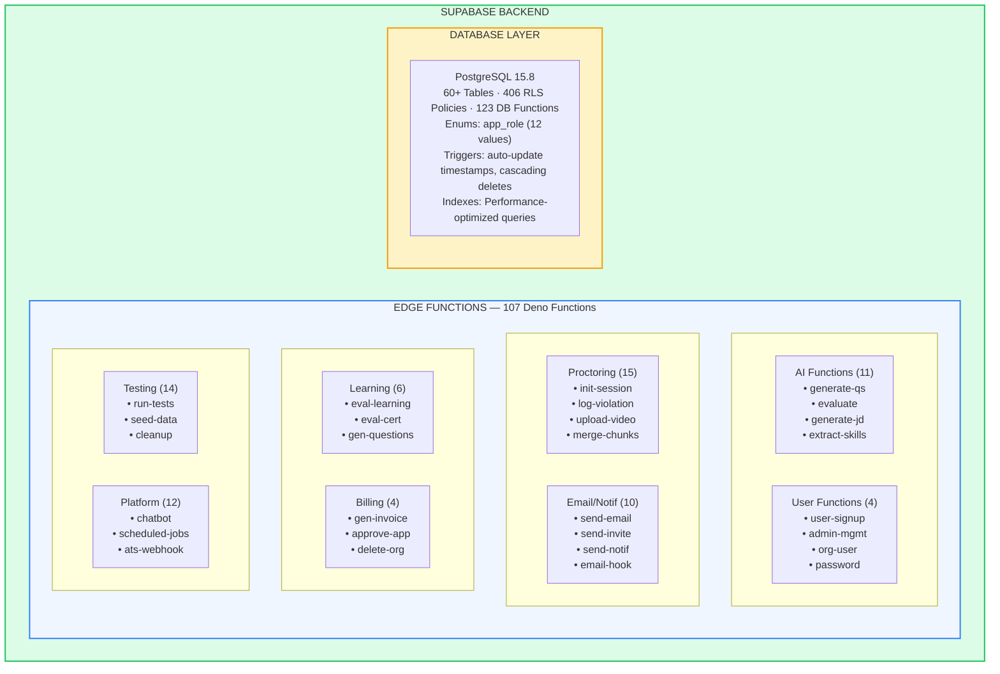

---

## 6. Data Architecture

### 6.1 Entity-Relationship Overview

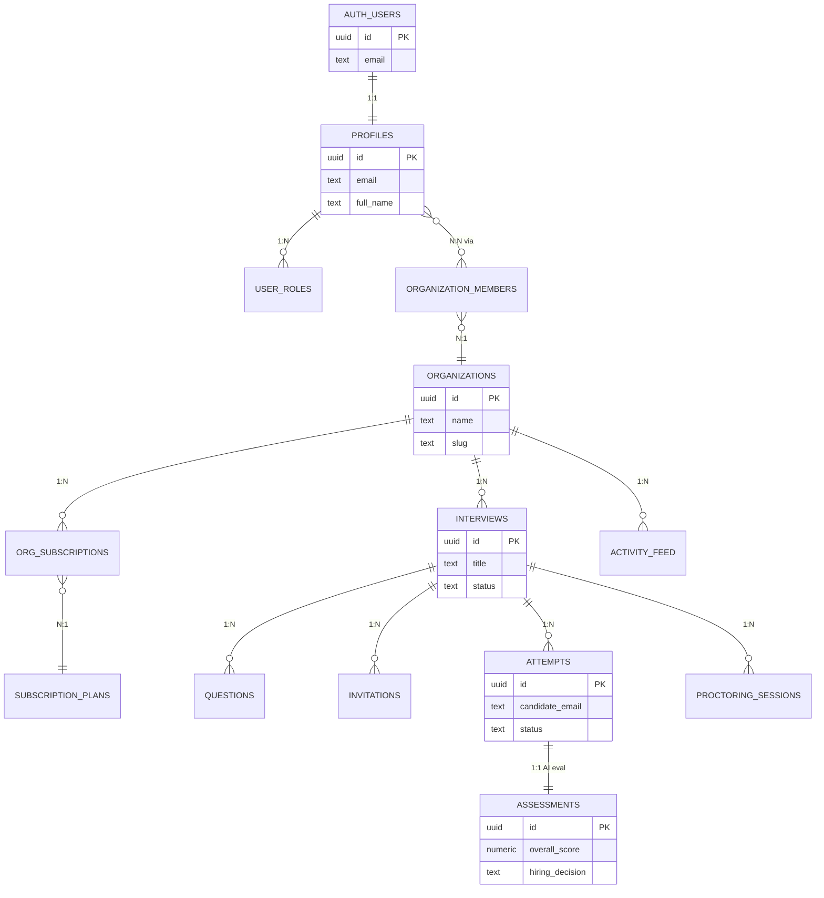

### 6.2 Data Domain Groups

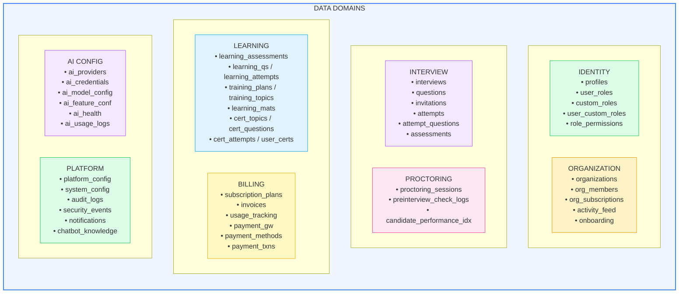

### 6.3 Multi-Tenant Data Isolation Model

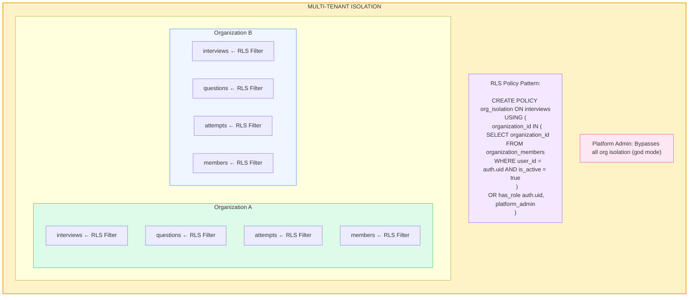

---

## 7. Authentication & Authorization Architecture

### 7.1 Authentication Flow

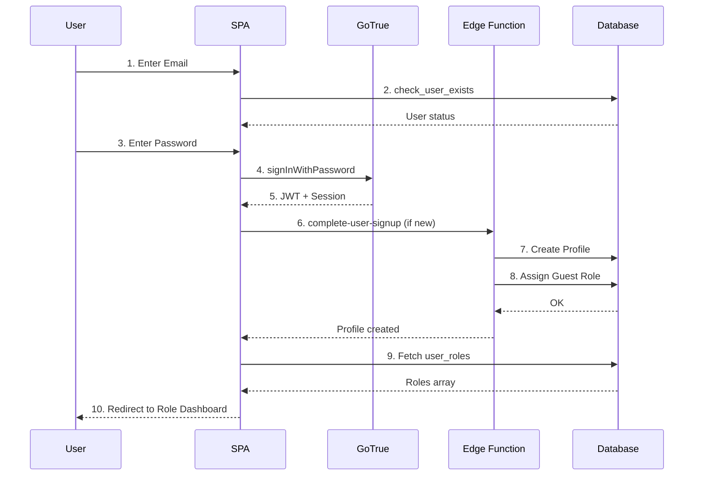

### 7.2 Authorization Layer Architecture

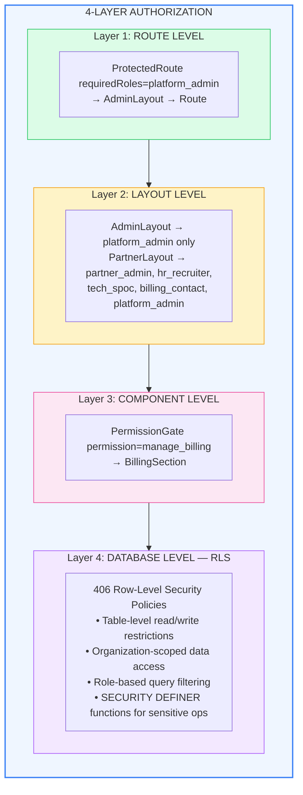

### 7.3 Role Hierarchy

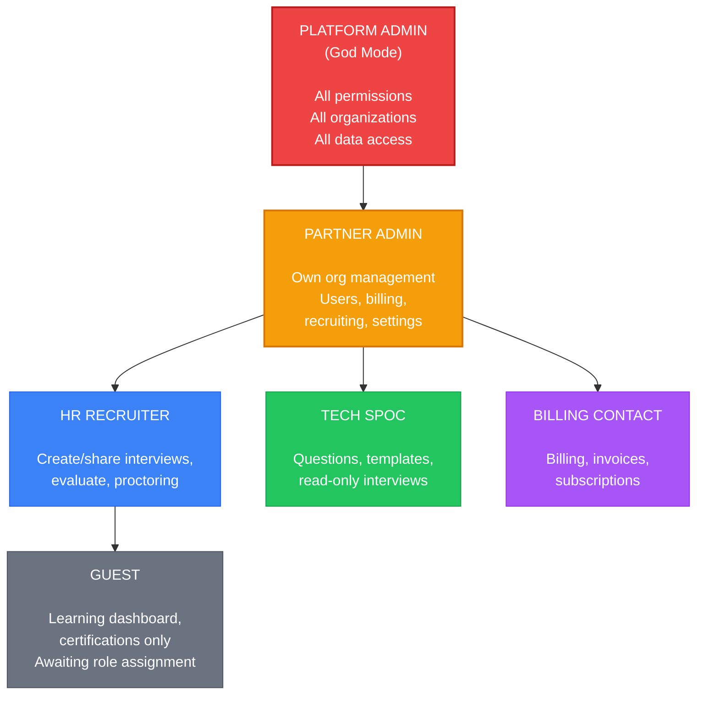

---

## 8. AI Architecture

### 8.1 AI Integration Architecture

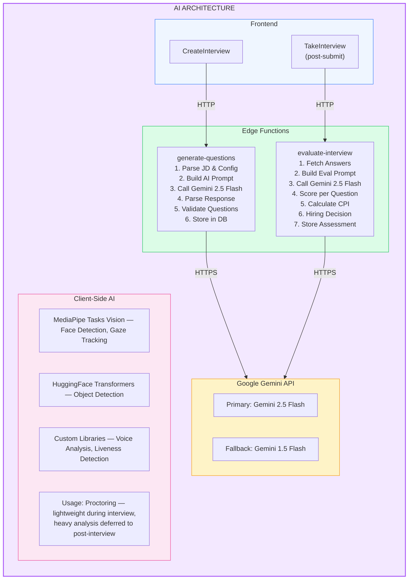

### 8.2 AI Feature Mapping

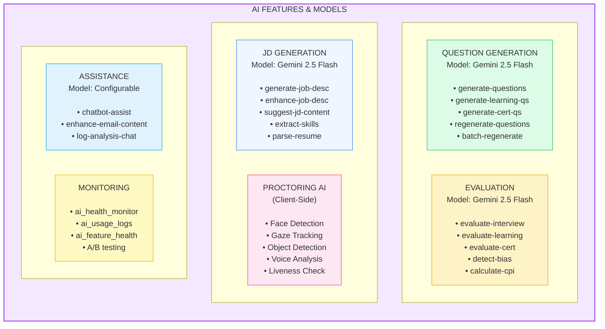

---

## 9. Infrastructure & Deployment Architecture

### 9.1 Docker Compose Architecture (Self-Hosted)

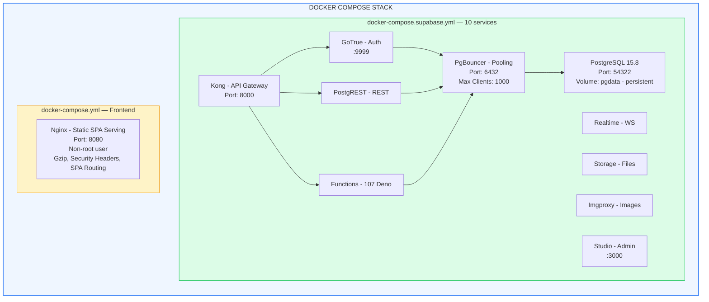

### 9.2 Production Deployment Architecture

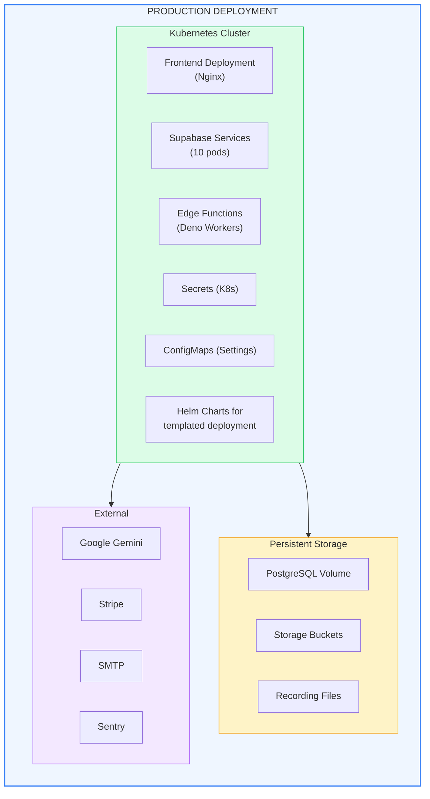

### 9.3 Build Pipeline

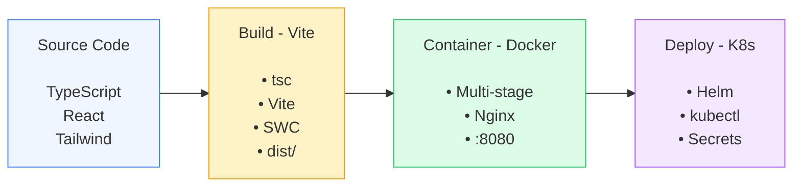

---

## 10. Integration Architecture

### 10.1 External System Integrations

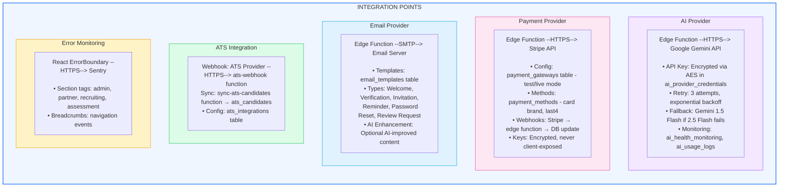

---

## 11. Key Design Decisions

### 11.1 Architecture Decisions

| # | Decision | Rationale | Trade-offs |
|---|----------|-----------|------------|
| **AD-01** | Self-hosted Supabase instead of cloud | Full data sovereignty, no vendor lock-in, customizable | Higher operational overhead |
| **AD-02** | React SPA instead of SSR (Next.js) | Simpler deployment (static via Nginx), Capacitor mobile support | No server-side rendering (SEO via meta tags) |
| **AD-03** | Edge Functions (Deno) for business logic | Serverless scaling, language alignment (TypeScript), Supabase-native | Cold start latency for first calls |
| **AD-04** | PostgreSQL RLS for multi-tenant isolation | Database-level security, no application-level leaks | Query performance overhead per policy |
| **AD-05** | Client-side AI for proctoring | Reduced server load, real-time detection, no video streaming to server | Higher client CPU usage |
| **AD-06** | Deferred heavy AI analysis to post-interview | Better interview experience (no lag during exam) | Delayed proctoring reports |
| **AD-07** | Kong API Gateway | Centralized auth header forwarding, rate limiting, CORS | Configuration complexity |
| **AD-08** | PgBouncer for connection pooling | Handle 1000+ concurrent connections | Prepared statement limitations |
| **AD-09** | React Query for server state | Automatic caching, deduplication, optimistic updates | Learning curve, cache invalidation |
| **AD-10** | shadcn/ui component library | Customizable, accessible, no runtime dependency | Manual component management |

### 11.2 Data Design Decisions

| # | Decision | Rationale |
|---|----------|-----------|
| **DD-01** | Session tokens (64-char) instead of incrementing IDs | Prevents attempt enumeration attacks |
| **DD-02** | SECURITY DEFINER functions for sensitive queries | Bypass RLS safely for candidate-facing queries |
| **DD-03** | AES encryption for API keys | Protect credentials at rest |
| **DD-04** | Immutable PII after attempt creation | Prevent post-submission tampering |
| **DD-05** | Separate correct_answer column with RLS | Candidates never see answers, even in API responses |

---

## 12. Scalability Strategy

### 12.1 Horizontal Scaling Points

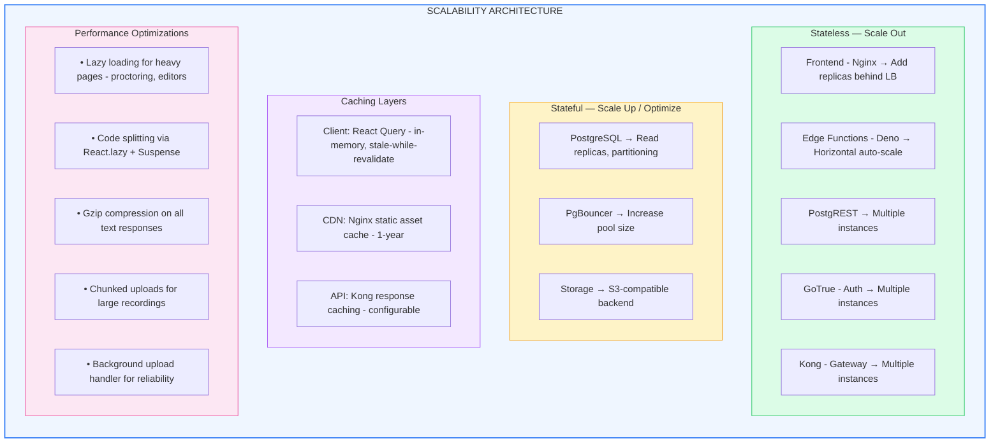

---

## 13. Security Architecture

### 13.1 Security Layers

```mermaid
flowchart TD
    subgraph DD["DEFENSE IN DEPTH"]
        direction TB
        subgraph SL1["Layer 1: NETWORK"]
            N1["• HTTPS/TLS 1.2+ - all traffic"]
            N2["• Kong API Gateway - rate limiting, CORS"]
            N3["• Nginx security headers - CSP, HSTS, X-Frame-Options"]
            N4["• Non-root container execution"]
        end
        subgraph SL2["Layer 2: AUTHENTICATION"]
            A1["• GoTrue - bcrypt passwords, JWT sessions"]
            A2["• Email verification required"]
            A3["• Automatic token refresh - 60s buffer"]
            A4["• Session token validation - 64-char per attempt"]
        end
        subgraph SL3["Layer 3: AUTHORIZATION"]
            Z1["• 6 hierarchical roles, 38 granular permissions"]
            Z2["• Route-level ProtectedRoute component"]
            Z3["• Component-level PermissionGate"]
            Z4["• 406 RLS policies on all database tables"]
            Z5["• SECURITY DEFINER functions for sensitive ops"]
        end
        subgraph SL4["Layer 4: DATA PROTECTION"]
            D1["• AES encryption for API keys at rest"]
            D2["• Correct answers hidden from candidates via RLS"]
            D3["• PII immutability after attempt creation"]
            D4["• Service role key restricted to edge functions"]
            D5["• Error message sanitization - no PG errors to client"]
        end
        subgraph SL5["Layer 5: MONITORING & AUDIT"]
            M1["• Sentry error monitoring with section tags"]
            M2["• Audit logs for admin actions"]
            M3["• Security event logs"]
            M4["• AI health and usage monitoring"]
            M5["• Pre-interview check logging"]
        end
    end

    SL1 --> SL2 --> SL3 --> SL4 --> SL5

    style DD fill:#eff6ff,stroke:#3b82f6,stroke-width:2px
    style SL1 fill:#dcfce7,stroke:#22c55e
    style SL2 fill:#fef3c7,stroke:#f59e0b
    style SL3 fill:#f3e8ff,stroke:#a855f7
    style SL4 fill:#fce7f3,stroke:#ec4899
    style SL5 fill:#e0f2fe,stroke:#0ea5e9
```

---

*End of High-Level Design Document*
