# TalentGeenie — Low-Level Design (LLD)

**Document Version:** 2.0  
**Date:** March 5, 2026  
**Product:** TalentGeenie — AI-Powered Interview & Learning Platform  
**Classification:** Internal / Confidential  

---

## Table of Contents

1. [Introduction](#1-introduction)
2. [Frontend Architecture Detail](#2-frontend-architecture-detail)
3. [Backend Service Detail](#3-backend-service-detail)
4. [Database Schema Detail](#4-database-schema-detail)
5. [API Design](#5-api-design)
6. [Core Flow Sequence Diagrams](#6-core-flow-sequence-diagrams)
7. [State Management Detail](#7-state-management-detail)
8. [Component Design](#8-component-design)
9. [Security Implementation Detail](#9-security-implementation-detail)
10. [Error Handling Architecture](#10-error-handling-architecture)
11. [Proctoring Engine Detail](#11-proctoring-engine-detail)
12. [File Upload Architecture](#12-file-upload-architecture)
13. [Configuration Management](#13-configuration-management)
14. [Testing Architecture](#14-testing-architecture)

---

## 1. Introduction

### 1.1 Purpose

This Low-Level Design (LLD) document provides the detailed technical design for every component of the TalentGeenie platform. It covers class-level design, data structures, algorithms, API contracts, sequence diagrams, and implementation details.

### 1.2 References

| Document | Location |
|----------|----------|
| Requirements (SRS) | `docs/REQUIREMENTS_DOCUMENT.md` |
| High-Level Design (HLD) | `docs/HIGH_LEVEL_DESIGN.md` |

---

## 2. Frontend Architecture Detail

### 2.1 Application Entry Point & Provider Hierarchy

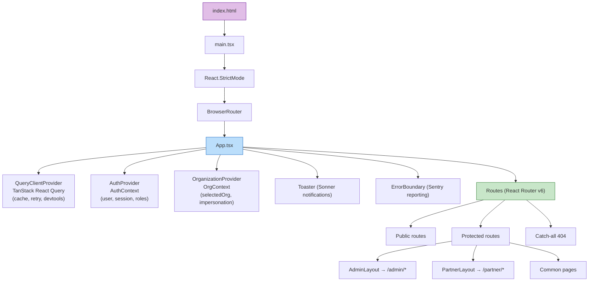

### 2.2 Routing Architecture

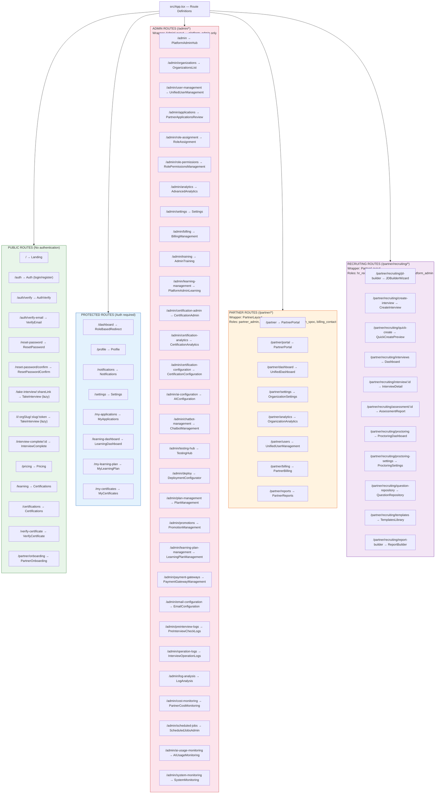

### 2.3 Layout Component Architecture

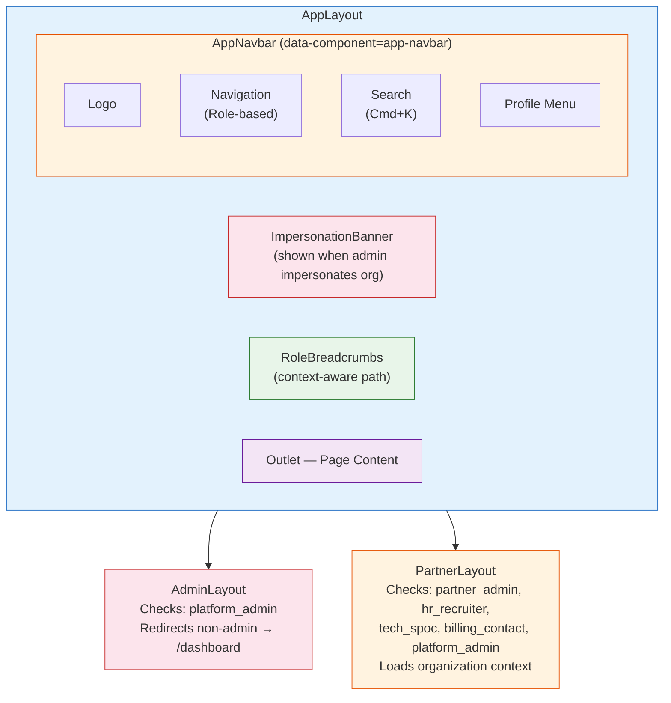

### 2.4 ProtectedRoute Component Design

```typescript
// src/components/ProtectedRoute.tsx

interface ProtectedRouteProps {
  children: React.ReactNode;
  requiredRoles?: AppRole[];
  requiredPermissions?: Permission[];
  redirectTo?: string;
}

// Decision tree:
//
// Is user authenticated?
//   NO  → redirect to /auth
//   YES → Is email verified? (if required)
//           NO  → show VerifyEmail
//           YES → Has required role?
//                   NO  → show AccessDenied / redirect
//                   YES → Has required permission?
//                           NO  → show AccessDenied
//                           YES → render children
```

### 2.5 Lazy Loading Strategy

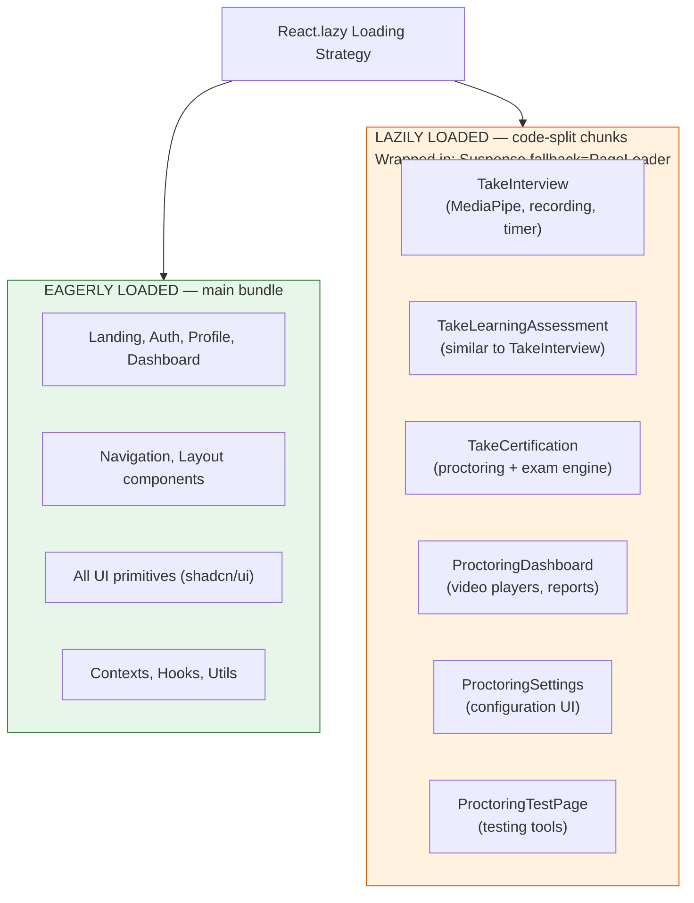

---

## 3. Backend Service Detail

### 3.1 Supabase Services Architecture

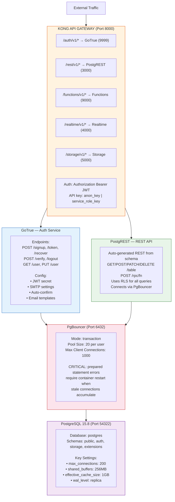

### 3.2 Edge Function Architecture

```mermaid
flowchart TD
    ROOT["supabase/functions/"] --> SHARED
    ROOT --> GQ
    ROOT --> EI
    ROOT --> CUS
    ROOT --> IPS
    ROOT --> SII
    ROOT --> MORE["100+ more functions..."]

    subgraph SHARED["_shared/ — Shared utilities"]
        S1["cors.ts — CORS headers"]
        S2["supabase-client.ts — Service role client"]
        S3["validation.ts — Input validation"]
    end

    subgraph GQ["generate-questions/ — AI question generation"]
        GQ1["Input: interviewId, config"]
        GQ2["Process:<br/>1. Fetch interview from DB<br/>2. Build prompt from JD + config<br/>3. Call Gemini 2.5 Flash API<br/>4. Parse structured JSON response<br/>5. Validate question count/types/difficulty<br/>6. Insert questions into DB"]
        GQ3["Output: questions[], count"]
        GQ1 --> GQ2 --> GQ3
    end

    subgraph EI["evaluate-interview/ — AI candidate evaluation"]
        EI1["Input: attemptId"]
        EI2["Process:<br/>1. Fetch attempt + questions + answers<br/>2. Build evaluation prompt<br/>3. Call Gemini 2.5 Flash API<br/>4. Parse scores per question<br/>5. Calculate overall score + CPI<br/>6. Determine hiring decision<br/>7. Insert assessment record"]
        EI3["Output: assessment"]
        EI1 --> EI2 --> EI3
    end

    subgraph CUS["complete-user-signup/ — Post-auth setup"]
        CUS1["Input: userId, email"]
        CUS2["Process:<br/>1. Check if profile exists<br/>2. Create profile (email_verified: false)<br/>3. Insert guest role into user_roles<br/>4. Initialize onboarding_progress<br/>5. Send welcome email"]
        CUS3["Output: success boolean"]
        CUS1 --> CUS2 --> CUS3
    end

    subgraph IPS["init-proctoring-session/ — Start proctoring"]
        IPS1["Input: attemptId, checks"]
        IPS2["Process:<br/>1. Create proctoring_session record<br/>2. Store pre-interview check results<br/>3. Generate signed upload URLs"]
        IPS3["Output: sessionId, uploadUrls"]
        IPS1 --> IPS2 --> IPS3
    end

    subgraph SII["send-interview-invitations/ — Email invitations"]
        SII1["Input: interviewId, candidates[]"]
        SII2["Process:<br/>1. Generate share tokens per candidate<br/>2. Create invitation records<br/>3. Build invitation emails<br/>4. Send via SMTP"]
        SII3["Output: sent count, failed count"]
        SII1 --> SII2 --> SII3
    end

    style SHARED fill:#e8f5e9,stroke:#2e7d32
    style GQ fill:#e3f2fd,stroke:#1565c0
    style EI fill:#fff3e0,stroke:#e65100
    style CUS fill:#f3e5f5,stroke:#6a1b9a
    style IPS fill:#fce4ec,stroke:#c62828
    style SII fill:#e1bee7,stroke:#6a1b9a
```

### 3.3 Edge Function Invocation Pattern

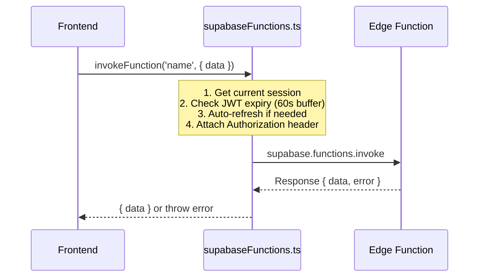

---

## 4. Database Schema Detail

### 4.1 Core Tables — Column-Level Design

#### `profiles` Table

```sql
CREATE TABLE profiles (
  id          UUID PRIMARY KEY REFERENCES auth.users(id) ON DELETE CASCADE,
  email       TEXT NOT NULL,
  full_name   TEXT,                -- 2-100 chars, letters/spaces/hyphens/apostrophes
  avatar_url  TEXT,
  phone       TEXT,
  bio         TEXT,
  created_at  TIMESTAMPTZ DEFAULT now(),
  updated_at  TIMESTAMPTZ DEFAULT now(),
  
  -- Email verification
  email_verified BOOLEAN DEFAULT false,
  
  CONSTRAINT profiles_email_check CHECK (length(email) <= 255),
  CONSTRAINT profiles_name_check CHECK (
    full_name IS NULL OR (
      length(full_name) >= 2 AND 
      length(full_name) <= 100 AND 
      full_name ~ '^[a-zA-Z\s''-]+$'
    )
  )
);

-- RLS Policies:
-- SELECT: Users can read own profile; platform_admin reads all
-- UPDATE: Users can update own profile only
-- INSERT: Triggered by complete-user-signup edge function
```

#### `user_roles` Table

```sql
CREATE TABLE user_roles (
  id          UUID PRIMARY KEY DEFAULT gen_random_uuid(),
  user_id     UUID NOT NULL REFERENCES profiles(id) ON DELETE CASCADE,
  role        app_role NOT NULL,
  assigned_by UUID REFERENCES profiles(id),
  assigned_at TIMESTAMPTZ DEFAULT now(),
  is_active   BOOLEAN DEFAULT true,
  
  UNIQUE(user_id, role)
);

-- app_role enum values:
-- 'platform_admin', 'partner_admin', 'hr_recruiter',
-- 'tech_spoc', 'billing_contact', 'guest',
-- Legacy: 'admin', 'hr', 'interviewer', 'contributor',
--         'candidate', 'ta_creator'
```

#### `organizations` Table

```sql
CREATE TABLE organizations (
  id            UUID PRIMARY KEY DEFAULT gen_random_uuid(),
  name          TEXT NOT NULL,
  slug          TEXT UNIQUE NOT NULL,
  logo_url      TEXT,
  industry      TEXT,
  size          TEXT,            -- 'startup', 'small', 'medium', 'large', 'enterprise'
  pricing_model TEXT,
  settings      JSONB DEFAULT '{}',
  is_active     BOOLEAN DEFAULT true,
  created_at    TIMESTAMPTZ DEFAULT now(),
  updated_at    TIMESTAMPTZ DEFAULT now(),
  created_by    UUID REFERENCES profiles(id)
);
```

#### `interviews` Table

```sql
CREATE TABLE interviews (
  id                    UUID PRIMARY KEY DEFAULT gen_random_uuid(),
  title                 TEXT NOT NULL,       -- 5-200 chars
  job_title             TEXT,
  job_description       TEXT NOT NULL,       -- 50-10,000 chars
  status                TEXT DEFAULT 'active',  -- 'draft', 'active', 'archived'
  question_count        INTEGER NOT NULL,    -- 5-100
  time_limit            INTEGER,             -- 0-180 minutes
  share_link            TEXT UNIQUE,
  skills                TEXT[],              -- Extracted skills array
  difficulty_distribution JSONB,             -- {easy: %, medium: %, hard: %}
  question_type_config  JSONB,               -- {mcq: n, scenario: n, coding: n, descriptive: n}
  topic_distribution    JSONB,               -- {topic: percentage, ...}
  proctoring_enabled    BOOLEAN DEFAULT false,
  expires_at            TIMESTAMPTZ,
  organization_id       UUID REFERENCES organizations(id),
  created_by            UUID REFERENCES profiles(id),
  created_at            TIMESTAMPTZ DEFAULT now(),
  updated_at            TIMESTAMPTZ DEFAULT now(),
  
  CONSTRAINT interviews_title_length CHECK (length(title) >= 5 AND length(title) <= 200),
  CONSTRAINT interviews_jd_length CHECK (length(job_description) >= 50),
  CONSTRAINT interviews_question_count CHECK (question_count >= 5 AND question_count <= 100)
);
```

#### `questions` Table

```sql
CREATE TABLE questions (
  id              UUID PRIMARY KEY DEFAULT gen_random_uuid(),
  interview_id    UUID NOT NULL REFERENCES interviews(id) ON DELETE CASCADE,
  question_text   TEXT NOT NULL,
  question_type   TEXT NOT NULL,      -- 'mcq', 'scenario', 'coding', 'descriptive'
  difficulty      TEXT NOT NULL,      -- 'easy', 'medium', 'hard'
  topic           TEXT,
  options         JSONB,              -- MCQ: [{label, value}]
  correct_answer  TEXT,               -- HIDDEN from candidates via RLS
  explanation     TEXT,
  code_template   TEXT,               -- For coding questions
  test_cases      JSONB,              -- For coding questions
  is_approved     BOOLEAN DEFAULT true,
  display_order   INTEGER,
  created_at      TIMESTAMPTZ DEFAULT now()
);

-- RLS: correct_answer column hidden from candidates
-- Only visible to interview creator / org members with view access
```

#### `interview_attempts` Table

```sql
CREATE TABLE interview_attempts (
  id              UUID PRIMARY KEY DEFAULT gen_random_uuid(),
  interview_id    UUID NOT NULL REFERENCES interviews(id),
  candidate_email TEXT NOT NULL,       -- IMMUTABLE after creation
  candidate_name  TEXT NOT NULL,       -- IMMUTABLE after creation
  session_token   TEXT NOT NULL,       -- 64-char base64, stored in sessionStorage
  answers         JSONB DEFAULT '{}',  -- {question_uuid: "answer text"}
  status          TEXT DEFAULT 'in_progress',  -- 'in_progress', 'completed', 'timed_out'
  time_taken      INTEGER,             -- seconds (0-86,400)
  started_at      TIMESTAMPTZ DEFAULT now(),
  completed_at    TIMESTAMPTZ,
  
  -- Prevents duplicate attempts
  UNIQUE(interview_id, candidate_email),
  
  -- PII immutability enforced by WITH CHECK:
  -- UPDATE cannot change candidate_email or candidate_name
);
```

#### `assessments` Table

```sql
CREATE TABLE assessments (
  id               UUID PRIMARY KEY DEFAULT gen_random_uuid(),
  attempt_id       UUID NOT NULL REFERENCES interview_attempts(id),
  overall_score    NUMERIC(5,2),       -- 0.00-100.00
  hiring_decision  TEXT,               -- 'strong_hire', 'hire', 'lean_hire', 'no_hire'
  strengths        TEXT[],
  weaknesses       TEXT[],
  topic_scores     JSONB,              -- {topic: {score, analysis}}
  detailed_analysis JSONB,             -- Per-question analysis
  cpi_technical    NUMERIC(5,2),
  cpi_problem_solving NUMERIC(5,2),
  cpi_communication NUMERIC(5,2),
  cpi_integrity    NUMERIC(5,2),
  created_at       TIMESTAMPTZ DEFAULT now(),
  
  UNIQUE(attempt_id)
);
```

### 4.2 Proctoring Tables

#### `proctoring_sessions` Table

```sql
CREATE TABLE proctoring_sessions (
  id                   UUID PRIMARY KEY DEFAULT gen_random_uuid(),
  attempt_id           UUID NOT NULL REFERENCES interview_attempts(id),
  video_url            TEXT,
  screen_recording_url TEXT,
  violations           JSONB DEFAULT '[]',
  integrity_score      NUMERIC(5,2),    -- 0-100
  tab_switch_count     INTEGER DEFAULT 0,
  look_away_count      INTEGER DEFAULT 0,
  face_detection_data  JSONB,
  eye_tracking_data    JSONB,
  voice_analysis_data  JSONB,
  review_status        TEXT DEFAULT 'pending',  -- 'pending', 'reviewed', 'flagged'
  upload_status        TEXT DEFAULT 'pending',  -- 'pending', 'uploading', 'complete', 'failed'
  created_at           TIMESTAMPTZ DEFAULT now(),
  updated_at           TIMESTAMPTZ DEFAULT now()
);
```

### 4.3 Billing Tables

```sql
-- subscription_plans
CREATE TABLE subscription_plans (
  id                  UUID PRIMARY KEY DEFAULT gen_random_uuid(),
  name                TEXT NOT NULL,
  price_monthly_cents INTEGER NOT NULL,    -- In cents (e.g., 9900 = $99.00)
  max_interviews      INTEGER,
  max_users           INTEGER,
  max_ai_usage        INTEGER,             -- AI tokens/month
  features            JSONB DEFAULT '{}',
  is_active           BOOLEAN DEFAULT true,
  created_at          TIMESTAMPTZ DEFAULT now()
);

-- organization_subscriptions
CREATE TABLE organization_subscriptions (
  id                UUID PRIMARY KEY DEFAULT gen_random_uuid(),
  organization_id   UUID REFERENCES organizations(id),
  plan_id           UUID REFERENCES subscription_plans(id),
  stripe_subscription_id TEXT,
  stripe_customer_id TEXT,
  status            TEXT DEFAULT 'active',  -- 'active', 'past_due', 'cancelled'
  current_period_start TIMESTAMPTZ,
  current_period_end   TIMESTAMPTZ,
  interviews_used   INTEGER DEFAULT 0,
  ai_tokens_used    INTEGER DEFAULT 0,
  created_at        TIMESTAMPTZ DEFAULT now()
);
```

### 4.4 Learning Tables

```sql
-- certification_topics
CREATE TABLE certification_topics (
  id             UUID PRIMARY KEY DEFAULT gen_random_uuid(),
  name           TEXT NOT NULL,
  provider       TEXT,              -- 'azure', 'aws', 'gcp', 'databricks', 'snowflake'
  difficulty     TEXT DEFAULT 'intermediate',
  passing_score  INTEGER DEFAULT 70,
  syllabus       JSONB,
  time_limit     INTEGER DEFAULT 60,  -- minutes
  is_active      BOOLEAN DEFAULT true,
  created_at     TIMESTAMPTZ DEFAULT now()
);

-- user_certificates
CREATE TABLE user_certificates (
  id                UUID PRIMARY KEY DEFAULT gen_random_uuid(),
  user_id           UUID REFERENCES profiles(id),
  certification_id  UUID REFERENCES certification_topics(id),
  attempt_id        UUID REFERENCES certification_attempts(id),
  verification_code TEXT UNIQUE NOT NULL,
  score             NUMERIC(5,2),
  issued_at         TIMESTAMPTZ DEFAULT now(),
  expires_at        TIMESTAMPTZ
);
```

### 4.5 Database Functions

```sql
-- Role checking (SECURITY DEFINER, SET search_path = public)
CREATE FUNCTION has_role(uid UUID, required_role app_role)
RETURNS BOOLEAN AS $$
  SELECT EXISTS (
    SELECT 1 FROM user_roles
    WHERE user_id = uid AND role = required_role AND is_active = true
  );
$$ LANGUAGE sql SECURITY DEFINER;

-- Secure interview creation for candidate
CREATE FUNCTION create_interview_attempt(
  p_interview_id UUID,
  p_candidate_email TEXT,
  p_candidate_name TEXT
) RETURNS TABLE(attempt_id UUID, session_token TEXT) AS $$
DECLARE
  v_token TEXT;
  v_attempt_id UUID;
BEGIN
  -- Generate 64-char base64 session token
  v_token := encode(gen_random_bytes(48), 'base64');
  
  INSERT INTO interview_attempts (interview_id, candidate_email, candidate_name, session_token)
  VALUES (p_interview_id, p_candidate_email, p_candidate_name, v_token)
  RETURNING id INTO v_attempt_id;
  
  RETURN QUERY SELECT v_attempt_id, v_token;
END;
$$ LANGUAGE plpgsql SECURITY DEFINER;

-- Questions retrieval (hides correct_answer)
CREATE FUNCTION get_questions_for_candidate(p_attempt_id UUID)
RETURNS TABLE(
  id UUID, question_text TEXT, question_type TEXT, 
  difficulty TEXT, topic TEXT, options JSONB,
  code_template TEXT, display_order INTEGER
) AS $$
  SELECT q.id, q.question_text, q.question_type,
         q.difficulty, q.topic, q.options,
         q.code_template, aq.display_order
  FROM attempt_questions aq
  JOIN questions q ON q.id = aq.question_id
  WHERE aq.attempt_id = p_attempt_id
  ORDER BY aq.display_order;
  -- NOTE: correct_answer is NOT returned
$$ LANGUAGE sql SECURITY DEFINER;

-- API key encryption
CREATE FUNCTION encrypt_api_key(plain_key TEXT, encryption_key TEXT)
RETURNS TEXT AS $$
  SELECT encode(
    encrypt(plain_key::bytea, encryption_key::bytea, 'aes'),
    'base64'
  );
$$ LANGUAGE sql SECURITY DEFINER;
```

### 4.6 Entity Relationship Diagram (Detailed)

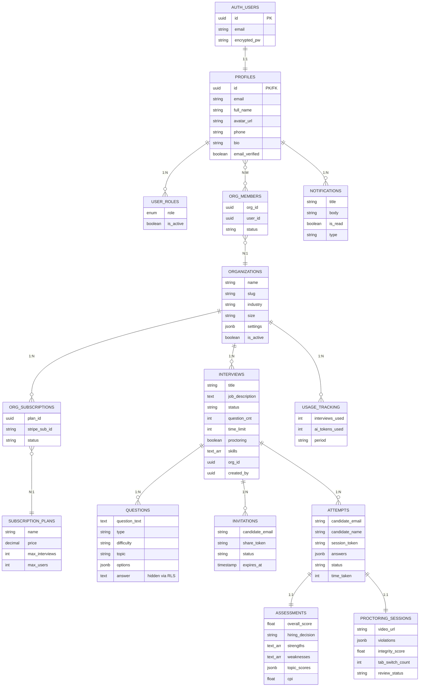

---

## 5. API Design

### 5.1 REST API (PostgREST — Auto-generated)

All tables are exposed via PostgREST with RLS filtering:

```
BASE: http://localhost:8000/rest/v1

Headers:
  apikey: <anon_key>
  Authorization: Bearer <jwt>
  Content-Type: application/json
  Prefer: return=representation (for INSERT/UPDATE)

GET    /interviews?organization_id=eq.<uuid>&status=eq.active&order=created_at.desc
GET    /interviews?id=eq.<uuid>&select=*,questions(*),interview_invitations(*)
POST   /interviews              { title, job_description, ... }
PATCH  /interviews?id=eq.<uuid>  { status: 'archived' }
DELETE /interviews?id=eq.<uuid>

GET    /profiles?id=eq.<uuid>
PATCH  /profiles?id=eq.<uuid>    { full_name, phone, bio }

GET    /notifications?select=*&order=created_at.desc&is_read=eq.false
PATCH  /notifications?id=eq.<uuid>  { is_read: true }

POST   /rpc/create_interview_attempt        { p_interview_id, p_email, p_name }
POST   /rpc/get_questions_for_candidate      { p_attempt_id }
POST   /rpc/update_attempt_with_session      { p_attempt_id, p_session_token, p_answers }
POST   /rpc/has_role                         { uid, required_role }
POST   /rpc/can_user_retake_certification    { user_id, cert_id }
```

### 5.2 Edge Function API

```
BASE: http://localhost:8000/functions/v1

Headers:
  Authorization: Bearer <jwt>
  Content-Type: application/json

POST /generate-questions
  Body: { interviewId: string, config?: object }
  Response: { questions: Question[], count: number }

POST /evaluate-interview
  Body: { attemptId: string }
  Response: { assessment: Assessment }

POST /send-interview-invitations
  Body: { interviewId: string, candidates: [{email, name}] }
  Response: { sent: number, failed: number }

POST /init-proctoring-session
  Body: { attemptId: string, checks: PreInterviewChecks }
  Response: { sessionId: string, uploadUrls: {...} }

POST /generate-job-description
  Body: { jobTitle: string, industry?: string, requirements?: string[] }
  Response: { description: string, skills: string[] }

POST /complete-user-signup
  Body: { userId: string, email: string }
  Response: { success: boolean }

POST /generate-certificate-pdf
  Body: { certificateId: string }
  Response: { pdfUrl: string }
```

### 5.3 Realtime Subscriptions

```typescript
// Notification subscription
supabase
  .channel('notifications')
  .on('postgres_changes', {
    event: 'INSERT',
    schema: 'public',
    table: 'notifications',
    filter: `user_id=eq.${userId}`
  }, (payload) => {
    // Show toast notification
  })
  .subscribe();

// Interview attempt status
supabase
  .channel(`attempt-${attemptId}`)
  .on('postgres_changes', {
    event: 'UPDATE',
    schema: 'public',
    table: 'interview_attempts',
    filter: `id=eq.${attemptId}`
  }, (payload) => {
    // Update UI on status change
  })
  .subscribe();
```

---

## 6. Core Flow Sequence Diagrams

### 6.1 Interview Creation & Question Generation Flow

```mermaid
sequenceDiagram
    participant HR as HR Recruiter
    participant CI as CreateInterview
    participant EF as Edge Function
    participant AI as Gemini AI
    participant DB as Database

    HR->>CI: Fill form: title, JD,<br/>questions config

    Note over CI: Validate (Zod):<br/>title 5-200 chars<br/>JD 50-10k chars<br/>questionCount 5-100<br/>types sum = total<br/>topics sum = 100%

    CI->>DB: INSERT interview
    DB-->>CI: interview.id

    CI->>EF: POST /functions/v1/<br/>generate-questions

    Note over EF: Build prompt:<br/>JD + config +<br/>type distribution

    EF->>AI: POST /v1/models/<br/>gemini-2.5-flash
    AI-->>EF: Structured JSON<br/>questions array

    Note over EF: Validate & parse
    EF->>DB: INSERT questions
    DB-->>EF: OK

    EF-->>CI: { questions, count }
    CI-->>HR: Show questions for review

    style HR fill:#e1bee7,stroke:#6a1b9a
    style AI fill:#fff9c4,stroke:#f9a825
    style DB fill:#c8e6c9,stroke:#2e7d32
```

### 6.2 Candidate Interview Taking Flow

```mermaid
sequenceDiagram
    participant C as Candidate
    participant TI as TakeInterview
    participant EF as Edge Functions
    participant DB as Database
    participant PR as Proctoring

    C->>TI: Open share link
    TI->>EF: resolve-invitation<br/>(3 retries, 1.5s backoff)
    EF->>DB: Verify token
    DB-->>EF: Token valid
    EF-->>TI: { invitation, interview }

    C->>TI: Enter name + email
    Note over TI: Validate:<br/>name 2-100 letters<br/>email matches invite

    alt If proctoring enabled
        C->>TI: Pre-interview checks
        Note over C,TI: PreInterviewChecks:<br/>1. Instructions<br/>2. Consent<br/>3. Setup: Camera ✓, Mic ✓,<br/>Network ✓, Lighting ✓, Person ✓<br/>4. Ready
    end

    TI->>DB: RPC: create_interview_attempt
    DB-->>TI: { attempt_id, session_token }<br/>64-char token

    TI->>EF: init-proctoring
    EF-->>TI: OK
    TI->>PR: Start monitor

    TI->>DB: RPC: get_questions_for_candidate
    DB-->>TI: Questions (no correct answers!)

    Note over C: ⏱ TIMER ON

    Note over C: Answer questions<br/>(MCQ, coding, scenario, descriptive)
    Note over PR: Monitoring:<br/>tab switch, copy detect,<br/>typing patterns

    C->>TI: Submit / Timer expires
    Note over TI: Validate:<br/>sessionToken ≥32ch<br/>answers valid<br/>timeTaken 0-86400

    TI->>DB: RPC: update_attempt_with_session
    DB-->>TI: OK

    TI->>EF: auto-evaluate-trigger
    Note over EF: evaluate-interview (async)

    TI-->>C: Redirect to /interview-complete/:id

    style C fill:#e1bee7,stroke:#6a1b9a
    style PR fill:#ffcdd2,stroke:#c62828
    style DB fill:#c8e6c9,stroke:#2e7d32
```

### 6.3 Authentication Flow (Detailed)

```mermaid
sequenceDiagram
    participant U as User
    participant AP as Auth Page
    participant GT as GoTrue
    participant EF as Edge Function
    participant DB as Database

    U->>AP: Enter email
    AP->>DB: RPC: check_user_exists
    DB-->>AP: exists? (boolean)

    alt User EXISTS (Sign In)
        AP-->>U: Show password field
        U->>AP: Enter password
        AP->>GT: POST /auth/v1/token<br/>?grant_type=password
        Note over GT: Verify bcrypt<br/>Generate JWT
        GT-->>AP: JWT + session
    else New User (Sign Up)
        AP-->>U: Show signup form
        U->>AP: Enter name + password
        AP->>GT: POST /auth/v1/signup
        Note over GT: Create auth.user<br/>Send verify email
        GT-->>AP: OK
        AP->>EF: complete-user-signup
        EF->>DB: Create profile
        EF->>DB: Assign guest role
        EF->>DB: Init onboarding
        EF->>DB: Send welcome
        DB-->>EF: OK
        EF-->>AP: Signup complete
        AP-->>U: "Check your email"
    end

    style U fill:#e1bee7,stroke:#6a1b9a
    style GT fill:#fff9c4,stroke:#f9a825
    style DB fill:#c8e6c9,stroke:#2e7d32
```

### 6.4 Learning Assessment Flow

```mermaid
sequenceDiagram
    participant U as User
    participant LD as LearningDash
    participant TC as TakeCertification
    participant EF as Edge Function
    participant DB as Database

    U->>LD: Select certification
    LD->>DB: can_user_retake_certification
    DB-->>LD: allowed: true

    LD-->>U: Navigate to /take-cert/:id

    Note over U: PreInterviewChecks:<br/>Instructions → Consent → Setup →<br/>Camera/Mic/Network/Lighting/Person

    LD->>TC: Create attempt
    TC->>DB: INSERT attempt
    DB-->>TC: attempt_id

    TC->>EF: generate-cert-questions
    Note over EF: Call Gemini AI
    EF-->>TC: Generated questions

    TC-->>U: Show questions + timer

    Note over U: Answer MCQ +<br/>coding + descriptive

    U->>TC: Submit
    TC->>EF: evaluate-cert
    Note over EF: score ≥ passing_score<br/>→ issue certificate
    EF-->>TC: Evaluation result

    TC-->>U: Show result (/cert-result)

    style U fill:#e1bee7,stroke:#6a1b9a
    style EF fill:#fff9c4,stroke:#f9a825
    style DB fill:#c8e6c9,stroke:#2e7d32
```

---

## 7. State Management Detail

### 7.1 AuthContext Implementation

```typescript
// src/contexts/AuthContext.tsx

interface AuthState {
  user: User | null;
  session: Session | null;
  loading: boolean;
  roles: AppRole[];
}

interface AuthContextValue extends AuthState {
  signIn: (email: string, password: string) => Promise<void>;
  signUp: (email: string, password: string, fullName: string) => Promise<void>;
  signOut: () => Promise<void>;
  hasRole: (role: AppRole) => boolean;
  hasAnyRole: (roles: AppRole[]) => boolean;
}

// State machine:
//
// INITIAL → loading=true, user=null
//   ↓ onAuthStateChange fires
// SIGNED_IN → loading=false, user=User, session=Session
//   ↓ ensureUserSetup()
//     ↓ fetchUserRoles() (setTimeout 0 to avoid deadlock)
// READY → roles populated, redirects active
//   
// SIGNED_OUT → loading=false, user=null, roles=[]

// God mode: hasAnyRole() returns true if user is platform_admin
// regardless of the requested roles
```

### 7.2 OrganizationContext Implementation

```typescript
// src/contexts/OrganizationContext.tsx

interface OrgContextValue {
  selectedOrgId: string | null;
  selectedOrg: Organization | null;
  availableOrgs: Organization[];
  isImpersonating: boolean;          // platform_admin viewing another org
  selectOrganization: (id: string) => void;
  clearImpersonation: () => void;
}

// Behavior:
// - platform_admin: Can select any org (OrganizationSelector component)
// - partner_admin: Locked to their org (auto-selected from org_members)
// - other roles: Linked to org via organization_members
```

### 7.3 React Query Usage Patterns

```typescript
// Data fetching pattern (used across all pages)

// List query with filters
const { data: interviews, isLoading } = useQuery({
  queryKey: ['interviews', orgId, status, page],
  queryFn: async () => {
    const { data, error } = await supabase
      .from('interviews')
      .select('*')
      .eq('organization_id', orgId)
      .eq('status', status)
      .order('created_at', { ascending: false })
      .range(page * 10, (page + 1) * 10 - 1);
    if (error) throw error;
    return data;
  },
  enabled: !!orgId,  // Only fetch when org is selected
});

// Mutation with optimistic update
const updateMutation = useMutation({
  mutationFn: async (data: Partial<Interview>) => {
    const { error } = await supabase
      .from('interviews')
      .update(data)
      .eq('id', interviewId);
    if (error) throw error;
  },
  onSuccess: () => {
    queryClient.invalidateQueries({ queryKey: ['interviews'] });
    toast.success('Interview updated');
  },
  onError: (error) => {
    toast.error(getUserFriendlyErrorMessage(error));
  },
});

// Edge function invocation
const generateMutation = useMutation({
  mutationFn: async () => {
    return invokeFunction('generate-questions', {
      interviewId,
      config: formData,
    });
  },
});
```

### 7.4 Custom Hooks Design

```typescript
// src/hooks/useUserRoles.ts
interface UseUserRolesReturn {
  roles: AppRole[];
  loading: boolean;
  isPlatformAdmin: boolean;
  isPartnerAdmin: boolean;
  isHRRecruiter: boolean;
  isTechSpoc: boolean;
  isBillingContact: boolean;
  isGuest: boolean;
  hasRole: (role: AppRole) => boolean;
  hasAnyRole: (roles: AppRole[]) => boolean;
  refetchRoles: () => Promise<void>;
}

// src/hooks/usePermissions.ts
interface UsePermissionsReturn {
  hasPermission: (permission: Permission) => boolean;
  hasAnyPermission: (permissions: Permission[]) => boolean;
  hasAllPermissions: (permissions: Permission[]) => boolean;
  userPermissions: Permission[];
}
// Maps roles → permissions via ROLE_PERMISSIONS constant in permissions.ts

// src/hooks/useProctoring.ts
interface UseProctoringReturn {
  isActive: boolean;
  violations: Violation[];
  tabSwitchCount: number;
  lookAwayCount: number;
  integrityScore: number;
  startMonitoring: () => void;
  stopMonitoring: () => void;
  logViolation: (type: ViolationType, data?: object) => void;
  getReport: () => ProctoringReport;
}
```

---

## 8. Component Design

### 8.1 Interview Creation Form Architecture

```mermaid
flowchart TD
    CI["CreateInterview (Page)"]

    CI --> BI["InterviewBasicInfo"]
    CI --> QT["QuestionTypeInputs"]
    CI --> CD["CategoryDifficultyInputs"]
    CI --> TD2["TopicDistribution"]
    CI --> RQ["RequiredQuestionRules"]
    CI --> PT["ProctoringToggle"]
    CI --> AB["ActionButtons"]

    BI --> BI1["Input: title<br/>(5-200 chars)"]
    BI --> BI2["Textarea: jobDescription<br/>(50-10,000 chars)"]
    BI --> BI3["Input: questionCount<br/>(5-100)"]
    BI --> BI4["Input: timeLimit<br/>(0-180 min)"]

    QT --> QT1["Input: mcqCount"]
    QT --> QT2["Input: scenarioCount"]
    QT --> QT3["Input: codingCount"]
    QT --> QT4["Input: descriptiveCount"]
    QT --> QTV["Validation: sum must<br/>equal questionCount"]

    CD --> CDS["Per-type difficulty sliders"]
    CDS --> CDE["Easy %"]
    CDS --> CDM["Medium %"]
    CDS --> CDH["Hard %"]
    CD --> CDV["Validation: each must<br/>sum to 100%"]

    TD2 --> TD2A["Extracted skills<br/>(from JD via AI)"]
    TD2 --> TD2B["Percentage per topic slider"]
    TD2 --> TD2V["Validation: must sum to 100%"]

    RQ --> RQR["Rule builder: at least N<br/>{difficulty} {type} on {topic}"]

    PT --> PTS["Switch: proctoring_enabled"]

    AB --> AB1["Save Draft"]
    AB --> AB2["Generate Questions<br/>(disabled when form invalid)"]
    AB --> AB3["Cancel"]

    style CI fill:#bbdefb,stroke:#1565c0
    style QTV fill:#fff9c4,stroke:#f9a825
    style CDV fill:#fff9c4,stroke:#f9a825
    style TD2V fill:#fff9c4,stroke:#f9a825
    style AB2 fill:#c8e6c9,stroke:#2e7d32
```

### 8.2 Proctoring Component Architecture

```mermaid
flowchart TD
    PIC["PreInterviewChecks"]

    PIC --> S1["Step 1: InstructionsStep"]
    S1 --> S1A["Rules list, continue button"]

    PIC --> S2["Step 2: ConsentStep"]
    S2 --> S2A["Checkbox: Allow proctoring"]
    S2 --> S2B["Checkbox: Allow recording"]
    S2 --> S2C["Checkbox: Allow data usage"]
    S2 --> S2D["Checkbox: Allow AI analysis"]
    S2 --> S2V["All required to proceed"]

    PIC --> S3["Step 3: SetupStep"]
    S3 --> NET["NetworkCheck<br/>5 x 1MB samples → median bandwidth<br/>Pass: ≥1 Mbps, Warn: <5 Mbps"]
    S3 --> CAM["CameraCheck<br/>getUserMedia(640x480) → validate stream"]
    S3 --> MIC["MicrophoneCheck<br/>Audio track presence check"]
    S3 --> LIT["LightingCheck<br/>checkCameraQuality() + brightness analysis"]
    S3 --> PER["PersonCheck<br/>detectFaces() → exactly 1 person required"]

    PIC --> S4["Step 4: ReadyStep"]
    S4 --> S4A["Confirmation to start"]

    PM["ProctoringMonitor<br/>(runs during assessment)"]

    PM --> PM1["useCandidateBroadcast → live stream"]
    PM --> PM2["FaceDetection → personCount, confidence"]
    PM --> PM3["GazeTracking → eye gaze coordinates"]
    PM --> PM4["VoiceAnalysis → voice count, anomalies"]

    PM --> PM5["TabSwitchDetector → visibilitychange API"]
    PM --> PM6["CopyPasteDetector → clipboard event intercept"]
    PM --> PM7["PrintScreenBlocker → keyboard event intercept"]
    PM --> PM8["MultiMonitorDetector → screen enumeration"]
    PM --> PM9["VMDetector → browser fingerprint"]
    PM --> PM10["TypingPatternAnalyzer → keystroke dynamics"]

    PM --> PM11["ScreenShareBlockingOverlay"]
    PM --> PM12["StreamHealthGuard → auto-recovery"]
    PM --> PM13["NetworkStatusBanner → connection quality"]
    PM --> PM14["ChunkUploader → periodic video uploads"]

    style PIC fill:#bbdefb,stroke:#1565c0
    style PM fill:#ffcdd2,stroke:#c62828
    style S2V fill:#fff9c4,stroke:#f9a825
    style S3 fill:#e8f5e9,stroke:#2e7d32
```

### 8.3 UI Component Library (shadcn/ui)

```mermaid
flowchart TD
    ROOT["src/components/ui/"]

    ROOT --> LC["Layout & Container"]
    ROOT --> FC["Form Controls"]
    ROOT --> DI["Display"]
    ROOT --> NAV["Navigation"]
    ROOT --> FB["Feedback"]

    LC --> LC1["card.tsx<br/>(Card, CardHeader, CardContent, CardFooter)"]
    LC --> LC2["dialog.tsx<br/>(Dialog, DialogContent, DialogHeader, DialogFooter)"]
    LC --> LC3["sheet.tsx<br/>(Sheet — slide-over panel)"]
    LC --> LC4["tabs.tsx<br/>(Tabs, TabsList, TabsTrigger, TabsContent)"]
    LC --> LC5["accordion.tsx<br/>(Accordion, AccordionItem, AccordionContent)"]
    LC --> LC6["separator.tsx<br/>(Visual separator)"]

    FC --> FC1["button.tsx<br/>(default|destructive|outline|secondary|ghost|link)"]
    FC --> FC2["input.tsx<br/>(text, email, password, number)"]
    FC --> FC3["textarea.tsx<br/>(multi-line text)"]
    FC --> FC4["select.tsx<br/>(single-select dropdown)"]
    FC --> FC5["checkbox.tsx / switch.tsx / slider.tsx"]
    FC --> FC6["calendar.tsx / form.tsx / command.tsx"]

    DI --> DI1["table.tsx<br/>(Table, TableHeader, TableBody, TableRow, TableCell)"]
    DI --> DI2["badge.tsx<br/>(status/tag badges)"]
    DI --> DI3["avatar.tsx / alert.tsx"]
    DI --> DI4["progress.tsx / skeleton.tsx / tooltip.tsx"]

    NAV --> NAV1["dropdown-menu.tsx<br/>(context menus)"]
    NAV --> NAV2["popover.tsx<br/>(positioned popover)"]
    NAV --> NAV3["sidebar.tsx<br/>(collapsible sidebar)"]
    NAV --> NAV4["breadcrumb.tsx<br/>(nav breadcrumbs)"]

    FB --> FB1["toast.tsx<br/>(Sonner-based toasts)"]
    FB --> FB2["sonner.tsx<br/>(toast provider)"]

    style ROOT fill:#bbdefb,stroke:#1565c0
    style LC fill:#e8f5e9,stroke:#2e7d32
    style FC fill:#fff3e0,stroke:#e65100
    style DI fill:#f3e5f5,stroke:#6a1b9a
    style NAV fill:#e0f7fa,stroke:#00695c
    style FB fill:#fce4ec,stroke:#c62828
```

---

## 9. Security Implementation Detail

### 9.1 RLS Policy Patterns

```sql
-- Pattern 1: User owns the resource
CREATE POLICY "users_own_data" ON profiles
  FOR ALL USING (id = auth.uid());

-- Pattern 2: Organization-scoped access
CREATE POLICY "org_member_access" ON interviews
  FOR SELECT USING (
    organization_id IN (
      SELECT organization_id FROM organization_members
      WHERE user_id = auth.uid() AND is_active = true
    )
    OR has_role(auth.uid(), 'platform_admin')
  );

-- Pattern 3: Role-restricted write
CREATE POLICY "hr_can_create" ON interviews
  FOR INSERT WITH CHECK (
    has_any_role(auth.uid(), ARRAY['platform_admin', 'partner_admin', 'hr_recruiter', 'tech_spoc'])
  );

-- Pattern 4: Candidate-only access (no auth required)
CREATE POLICY "candidate_read_attempt" ON interview_attempts
  FOR SELECT USING (
    session_token IS NOT NULL
    -- Validated in SECURITY DEFINER function
  );

-- Pattern 5: Immutable fields
CREATE POLICY "attempt_update_restrict" ON interview_attempts
  FOR UPDATE WITH CHECK (
    candidate_email = (SELECT candidate_email FROM interview_attempts WHERE id = id)
    AND candidate_name = (SELECT candidate_name FROM interview_attempts WHERE id = id)
  );
```

### 9.2 Error Sanitization Pipeline

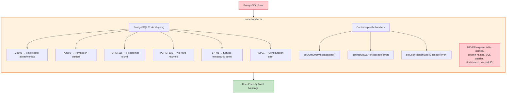

### 9.3 Token Flow

```mermaid
flowchart TD
    subgraph JWT["Session JWT"]
        direction TB
        J1["Created: GoTrue on sign-in"]
        J2["Storage: Browser (managed by Supabase client)"]
        J3["Lifetime: Configurable (default 1 hour)"]
        J4["Refresh: Auto-refresh with 60s buffer"]
        J5["Claims: { sub: user_id, role: authenticated,<br/>email, iat, exp }"]
        J6["Used by: All PostgREST queries, edge function calls"]
        J7["RLS reads: auth.uid&#40;&#41; extracts sub from JWT"]
    end

    subgraph IST["Interview Session Token"]
        direction TB
        I1["Created: create_interview_attempt&#40;&#41; PG function"]
        I2["Value: 64-char base64 (gen_random_bytes(48))"]
        I3["Storage: Browser sessionStorage (not localStorage)"]
        I4["Lifetime: Duration of interview attempt"]
        I5["Used by: update_attempt_with_session&#40;&#41; to validate"]
        I6["Purpose: Prevents unauthorized answer submission"]
        I7["Cannot: Be guessed or enumerated"]
    end

    subgraph API["API Keys (AI Providers)"]
        direction TB
        A1["Storage: ai_provider_credentials table"]
        A2["Encryption: AES via encrypt_api_key&#40;&#41; function"]
        A3["Decryption: Only in SECURITY DEFINER functions"]
        A4["Access: Edge functions only (service role)"]
        A5["Never: Sent to client or exposed in API responses"]
    end

    style JWT fill:#bbdefb,stroke:#1565c0
    style IST fill:#fff9c4,stroke:#f9a825
    style API fill:#ffcdd2,stroke:#c62828
```

---

## 10. Error Handling Architecture

### 10.1 Error Boundary Hierarchy

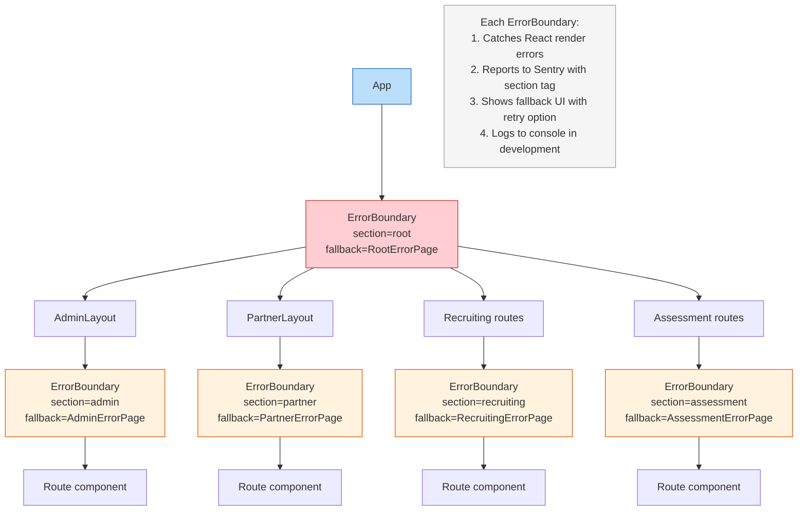

### 10.2 Retry Strategy

```typescript
// src/lib/retryUtils.ts

interface RetryConfig {
  maxAttempts: number;      // Default: 3
  initialDelay: number;     // Default: 1000ms
  maxDelay: number;         // Default: 5000ms
  backoffMultiplier: number; // Default: 1.5
}

function isRetryable(error: Error): boolean {
  // Retryable:
  // - Network errors (TypeError: Failed to fetch)
  // - Timeout errors
  // - HTTP 500, 502, 503, 504
  // - HTTP 429 (rate limited)
  
  // NOT retryable:
  // - HTTP 400, 401, 403, 404, 409
  // - Validation errors
  // - Auth errors
}

// Retry flow:
// Attempt 1 → fail → wait 1.0s
// Attempt 2 → fail → wait 1.5s
// Attempt 3 → fail → throw error
```

### 10.3 Logging Layers

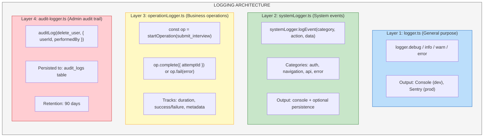

---

## 11. Proctoring Engine Detail

### 11.1 Violation Detection Pipeline

```mermaid
flowchart TD
    subgraph PIPELINE["PROCTORING DETECTION PIPELINE"]
        direction TB

        subgraph RT["REAL-TIME (During Interview)"]
            direction TB
            EL["Event Listeners"]
            EL --> EL1["document.visibilitychange → tab_switch"]
            EL --> EL2["document.copy/paste → copy_attempt"]
            EL --> EL3["keyboard.PrintScreen → print_screen"]
            EL --> EL4["keystroke timing → suspicious_typing"]

            AC["API Checks"]
            AC --> AC1["screen.availWidth > window.innerWidth<br/>→ multiple_monitors"]
            AC --> AC2["navigator.userAgent patterns<br/>→ virtual_machine"]
            AC --> AC3["MediaStream.onended<br/>→ screen_share_stopped"]
        end

        subgraph DEF["DEFERRED (Post-Interview Analysis)"]
            direction TB
            MP["MediaPipe Tasks Vision"]
            MP --> FD["Face Detection:<br/>personCount > 1 → multiple_persons (HIGH)<br/>confidence < threshold → look_away (LOW)"]
            MP --> GT2["Gaze Tracking:<br/>off-screen > 3s → look_away (LOW)<br/>erratic pattern → eye_movement (LOW)"]

            VA["Voice Analysis"]
            VA --> VA1["Multiple voice profiles → multiple_voices (MED)"]
            VA --> VA2["Silence patterns → silence_anomaly (LOW)"]
            VA --> VA3["TTS/recording detected → audio_playback (MED)"]

            AD["Advanced Detection"]
            AD --> AD1["Face mismatch → person_swap (HIGH)"]
            AD --> AD2["Liveness check fail → liveness_fail (HIGH)"]
            AD --> AD3["Object detection → phone_detected (HIGH)"]
            AD --> AD4["Object detection → prohibited_object (HIGH)"]
        end

        subgraph SCORE["Severity Scoring"]
            SC1["HIGH violations: -10 points each"]
            SC2["MEDIUM violations: -5 points each"]
            SC3["LOW violations: -2 points each"]
            SC4["Integrity Score = 100 - sum&#40;penalties&#41;<br/>Minimum: 0"]
        end
    end

    style PIPELINE fill:#f5f5f5,stroke:#616161
    style RT fill:#bbdefb,stroke:#1565c0
    style DEF fill:#fff3e0,stroke:#e65100
    style SCORE fill:#ffcdd2,stroke:#c62828
```

### 11.2 Recording Architecture

```mermaid
flowchart TD
    subgraph RECORD["RECORDING & UPLOAD PIPELINE"]
        direction TB
        CS["Camera Stream"] --> MR["MediaRecorder (WebM)"]
        MR -->|"Chunk every 30s"| CU["ChunkUploader"]
        CU --> GU["get-chunk-upload-url<br/>(signed URL)"]
        GU --> US["Upload to Storage<br/>(background, retryable)"]

        MR -->|"On Interview Complete"| MERGE["merge-proctoring-chunks"]
        MERGE --> REPAIR["repair-webm-metadata"]
        REPAIR --> CONFIRM["confirm-proctoring-upload"]
        CONFIRM --> FINAL["proctoring_sessions.video_url = final URL<br/>upload_status = complete"]

        SS["Screen Share Stream<br/>(same pipeline)"] --> MR
    end

    subgraph GUARD["Upload Guard"]
        direction TB
        UL["uploadLock.ts:<br/>• Prevents duplicate uploads<br/>• Tracks pending chunks<br/>• Retries failed chunks (3 attempts)"]
        UP["uploadProgressStore.ts:<br/>• Progress percentage per chunk<br/>• Total progress calculation<br/>• UI progress bar binding"]
        BG["BackgroundUploadHandler.tsx:<br/>• Resumes interrupted uploads<br/>• Runs as app-level component<br/>• Shows UploadProgressOverlay"]
    end

    style RECORD fill:#bbdefb,stroke:#1565c0
    style GUARD fill:#fff3e0,stroke:#e65100
    style FINAL fill:#c8e6c9,stroke:#2e7d32
```

---

## 12. File Upload Architecture

### 12.1 Upload Flow

```mermaid
sequenceDiagram
    participant CO as Component
    participant CU as ChunkUploader
    participant EF as Edge Function
    participant ST as Storage

    CO->>CU: Start recording

    loop Every 30 seconds
        CO->>CU: dataavailable event
        CU->>EF: get-chunk-upload-url
        EF-->>CU: { signedUrl, path }
        CU->>ST: PUT signedUrl (blob)
        ST-->>CU: 200 OK
        CU-->>CO: progress update
    end

    Note over CO: On completion
    CU->>EF: merge-proctoring-chunks
    EF->>ST: Merge to single file
    ST-->>EF: OK
    EF-->>CU: { videoUrl }

    style CO fill:#bbdefb,stroke:#1565c0
    style ST fill:#c8e6c9,stroke:#2e7d32
```

---

## 13. Configuration Management

### 13.1 Environment Variables

```mermaid
flowchart TD
    subgraph FE["Frontend (Vite — VITE_ prefix)"]
        F1["VITE_SUPABASE_URL = http://localhost:8000"]
        F2["VITE_SUPABASE_PUBLISHABLE_KEY = anon_key"]
        F3["VITE_SENTRY_DSN = sentry_dsn"]
        F4["VITE_APP_ENV = development | production"]
    end

    subgraph BE["Backend (Docker environment)"]
        B1["POSTGRES_PASSWORD = db_password"]
        B2["JWT_SECRET = jwt_signing_secret"]
        B3["ANON_KEY / SERVICE_ROLE_KEY"]
        B4["GOTRUE_SMTP_HOST / PORT / USER / PASS"]
        B5["GOTRUE_EXTERNAL_EMAIL_ENABLED = true"]
        B6["GOOGLE_AI_API_KEY = gemini_key"]
        B7["STRIPE_SECRET_KEY = stripe_key"]
    end

    style FE fill:#bbdefb,stroke:#1565c0
    style BE fill:#fff3e0,stroke:#e65100
```

### 13.2 Platform Configuration System

```mermaid
flowchart TD
    subgraph HIER["CONFIGURATION HIERARCHY"]
        direction TB
        P1["1. Environment Variables<br/>(highest priority)"]
        P1 --> P1A["Build-time: VITE_* variables"]
        P1 --> P1B["Runtime: Docker env vars"]

        P2["2. Database Configuration"]
        P2 --> P2A["platform_configurations<br/>(key-value pairs)"]
        P2 --> P2B["system_config<br/>(system-level settings)"]
        P2 --> P2C["ai_feature_configurations<br/>(AI feature flags)"]

        P3["3. Organization Settings"]
        P3 --> P3A["organizations.settings<br/>(JSONB per-org config)"]

        P4["4. Code Defaults"]
        P4 --> P4A["src/lib/configuration.ts<br/>(default values)"]
        P4 --> P4B["src/lib/configurationPresets.ts<br/>(presets)"]

        P1 ~~~ P2
        P2 ~~~ P3
        P3 ~~~ P4
    end

    style P1 fill:#ffcdd2,stroke:#c62828
    style P2 fill:#fff3e0,stroke:#e65100
    style P3 fill:#fff9c4,stroke:#f9a825
    style P4 fill:#c8e6c9,stroke:#2e7d32
```

---

## 14. Testing Architecture

### 14.1 Test Stack

```mermaid
flowchart TD
    subgraph ARCH["TESTING ARCHITECTURE"]
        direction TB

        subgraph E2E["E2E Tests (Playwright)"]
            direction TB
            EC["Config: playwright.config.ts<br/>Browser: Chromium only<br/>Workers: 1 (sequential)<br/>Timeout: 60s per test<br/>Base URL: http://localhost:5174"]
            EF["Test Files:<br/>e2e/11-rbac through 18-profile<br/>e2e/flow-01 through flow-18"]
            ES["Total: 630 tests, all passing<br/>Runtime: ~1 hour (sequential)"]
            EH["Helpers:<br/>helpers.ts, auth-utils.ts, globalSetup.ts"]
        end

        subgraph UNIT["Unit Tests (Vitest)"]
            UC["Config: vitest.config.ts<br/>Coverage: lcov reporting<br/>Scope: Utility functions, validators, helpers"]
        end

        subgraph SEED["Test Data Seeding"]
            direction TB
            SU["6 Test Users:<br/>e2e-admin (platform_admin)<br/>e2e-partner (partner_admin)<br/>e2e-hr (hr_recruiter)<br/>e2e-tech (tech_spoc)<br/>e2e-billing (billing_contact)<br/>e2e-guest (guest)"]
            SD["Seeded via globalSetup:<br/>Organization, Interviews,<br/>Subscription plans,<br/>Notifications, Training data"]
        end
    end

    style ARCH fill:#f5f5f5,stroke:#616161
    style E2E fill:#bbdefb,stroke:#1565c0
    style UNIT fill:#c8e6c9,stroke:#2e7d32
    style SEED fill:#fff9c4,stroke:#f9a825
```

### 14.2 Test Categories

```mermaid
flowchart TD
    subgraph MATRIX["TEST COVERAGE MATRIX"]
        direction TB
        R1["RBAC/Access Control — 11-rbac — ~50 tests — Security"]
        R2["Platform Admin Deep — 12-admin — ~40 tests — Feature"]
        R3["Partner Admin Deep — 13-partner — ~30 tests — Feature"]
        R4["HR Recruiter Deep — 14-hr — ~35 tests — Feature"]
        R5["Tech SPOC Deep — 15-tech — ~25 tests — Feature"]
        R6["Billing Contact Deep — 16-billing — ~25 tests — Feature"]
        R7["Guest User Deep — 17-guest — ~30 tests — Feature"]
        R8["Profile/Notifications — 18-profile — ~30 tests — Feature"]
        R9["Flow Tests 01-12 — flow-01-12 — 98 tests — E2E Flow"]
        R10["Profile CRUD — flow-13 — 9 tests — CRUD"]
        R11["Interview CRUD — flow-14 — 13 tests — CRUD"]
        R12["User Management CRUD — flow-15 — 11 tests — CRUD"]
        R13["Form Validation — flow-16 — 12 tests — Validation"]
        R14["Data Persistence — flow-17 — 21 tests — API"]
        R15["Candidate Journey — flow-18 — 23 tests — E2E Flow"]
        TOTAL["TOTAL: 26 files — 630 tests"]
    end

    style MATRIX fill:#f5f5f5,stroke:#616161
    style R1 fill:#ffcdd2,stroke:#c62828
    style R9 fill:#bbdefb,stroke:#1565c0
    style R15 fill:#bbdefb,stroke:#1565c0
    style TOTAL fill:#c8e6c9,stroke:#2e7d32
```

---

*End of Low-Level Design Document*
